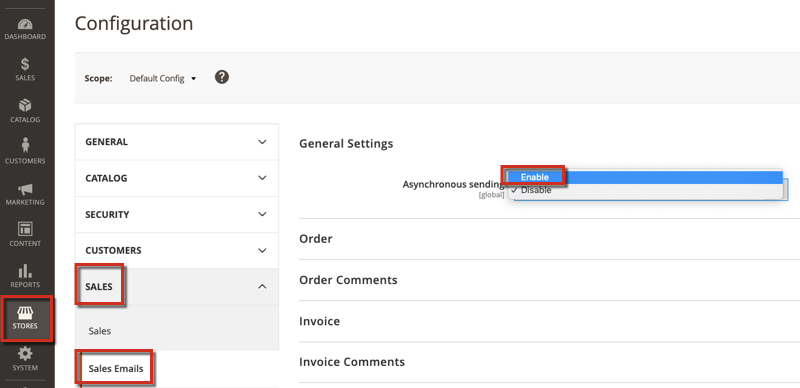

# Best practices Adobe Commerce order placement performance

This article provides best practices for order processing and checkout performance for Adobe Commerce.

## Affected products and versions

* Adobe Commerce on-premises, all [supported versions](https://magento.com/sites/default/files/magento-software-lifecycle-policy.pdf)  
* Adobe Commerce on cloud infrastructure, all [supported versions](https://magento.com/sites/default/files/magento-software-lifecycle-policy.pdf)

## Best practices

It is recommended that you enable the Async email notification and Order archive features.

### Enable Async email notifications

Enable the Async email notification functionality to improve the performance of placing an order. This moves the order processing email notifications to the background. To enable this feature:

1. Go to the Commerce Admin Panel.
1. Click on **STORES** > Settings > **Configuration**.
1. Then go to **Sales** > **Sales Emails** > **General Settings** > **Asynchronous sending**.        
1. Save the config.

### Enable Order archive

Sales tables might take a lot of space overtime, so enabling archiving would save MySQL disk space and improve checkout performance.
To enable the feature, follow the instructions in [Archive > To enable archiving](https://docs.magento.com/user-guide/sales/order-archive.html#to-enable-archiving) in our user guide.

## Related reading

Refer to [Performance Best Practices > Best Practices](https://devdocs.magento.com/guides/v2.4/performance-best-practices/configuration.html#asynchronous-email-notifications) in our developer documentation.