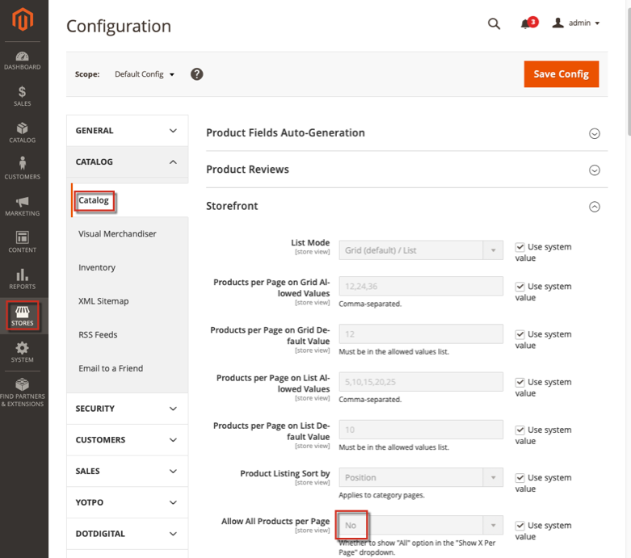

# Products per page limit Adobe Commerce

This article provides a best practice for using the **Allow All Products per Page** setting, depending on your catalog size, to optimize Adobe Commerce storefront performance.

## Affected products and versions

* Adobe Commerce on-premises, all [supported versions](https://magento.com/sites/default/files/magento-software-lifecycle-policy.pdf)
* Adobe Commerce on cloud infrastructure, all [supported versions](https://magento.com/sites/default/files/magento-software-lifecycle-policy.pdf)

## Best practice

You can configure Adobe Commerce to allow shoppers to view all category products on a single page. But if the number of category products significantly exceeds 48 products, it may take a long time for them to render.

The recommendation is to set the **Allow All Products per page** configuration to *No*, if you have more than 48 products in any category.

To change this configuration, in the Commerce Admin Panel go to **Stores** > **Configuration** > **Catalog** > **Catalog** > **Storefront** > **Allow All Products per page** = *No*.

## Related reading

 [Catalog page in our user guide](https://docs.magento.com/user-guide/configuration/catalog/catalog.html)