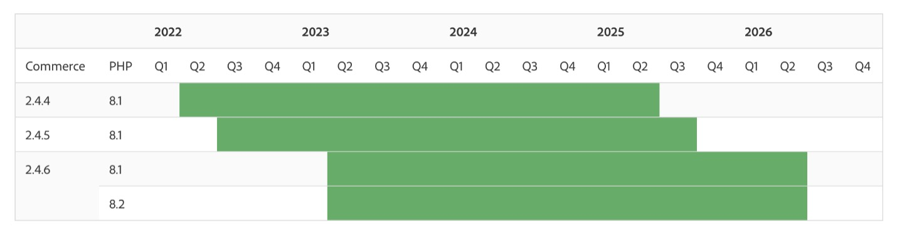

# FAQ for the 2023 Adobe Commerce Release Strategy and Lifecycle Policy

## 2023 Release Strategy and Updated Lifecycle Policy

### How is the Adobe Commerce Software Lifecycle Policy changing in 2023?

To meet the mission-critical needs of Adobe Commerce customers, we are expanding our support window for Adobe Commerce 2.4.4 and later versions to **3 years from the version GA date**. Support includes **both security and quality patches**. 

### How will these changes benefit customers?

The longer support window recognizes the complexity our customers face operating multiple sites around the globe and enables them to get more value from each deployment. Customers can stay on releases for a longer period, which reduces total cost of ownership and frees resources to focus on adding new functionality or customizing the buying experience to drive faster growth.

### Where can customers find our current lifecycle policy?

The [Adobe Commerce Software Lifecycle Policy](https://www.adobe.com/content/dam/cc/en/legal/terms/enterprise/pdfs/Adobe-Commerce-Software-Lifecycle-Policy.pdf) is available online.

### When will customers on 2.4.4, 2.4.5, and 2.4.6 reach end-of-support under this new policy?

Customers on Adobe Commerce 2.4.4+ will receive security and quality fixes for 3 years from the version GA date as shown in the timeline below. See the [Released Versions](https://experienceleague.adobe.com/docs/commerce-operations/release/versions.html) page on Experience League for specific end-of-support dates.

### How is the Adobe Commerce release schedule changing?

To accelerate innovation and reduce the total cost of ownership, there will be one core application patch released per year, with new capabilities delivered as composable SaaS services that can be added at any time. The number of security patch releases planned for this year is also increasing from three to four to help customers stay more secure. Additional beta releases for the 2024 core application patch release (2.4.7) will also be made available this year to help partners and customers prepare for the next release.

### How does the new release schedule benefit customers?

Delivering new capabilities as composable SaaS services provides customers with faster access to new tools that can help increase their sales. Functionality can be adopted at any time without having to upgrade the core Adobe Commerce application. And these services can be continually updated by Adobe to deliver the latest advances in functionality and performance. Having one core application patch release per year helps to reduce upgrade costs, makes it easier to plan for upgrades, and provides more time for customizing and optimizing the commerce experience. Additional lightweight security patches help customers stay more secure.

### Where is the Adobe Commerce release schedule posted?

Check out the [Adobe Commerce 2023 release schedule](https://experienceleague.adobe.com/docs/commerce-operations/release/planning/schedule.html) on Experience League for more details.

### What are the different types of releases included on the schedule?

* **Core application patch releases**: core application upgrade that includes security, performance, and high-priority quality fixes.
* **Beta version patch releases**: non-General Availability code updates to the core Adobe Commerce application that include security, compliance, performance, and high-priority quality fixes. It allows extra time to review code and affected components before patch release GA.
* **Feature releases**: releases of new features and feature updates that are delivered as composable services, separate from the patch releases. Examples include services like [!DNL Product Recommendations] and [!DNL Live Search], independent modules like [!DNL PWA Studio] and [!DNL Inventory Management] (MSI), and updates to our cloud services and infrastructure.
* **Security patch releases**: security-only updates to the core application released to keep customers secure and compliant.

### Where do customers go to get quality patches?

Quality patches are a way to distribute fixes for individual quality issues. Customers can contact Adobe Support or use the [[!DNL Quality Patch Tool]](https://experienceleague.adobe.com/docs/commerce-knowledge-base/kb/announcements/commerce-announcements/magento-quality-patches-released-new-tool-to-self-serve-quality-patches.html) to find quality patches.

### What resources are available to help with planning, budgeting, and upgrades in general?

Available resources include a comprehensive 2.4 Upgrade Guide, Technical Upgrade Workshop Recording, and the [!DNL Upgrade Compatibility Tool]. A comprehensive list of resources can be found on [Experience League](https://experienceleague.adobe.com/docs/commerce-operations/upgrade-guide/resources/recommended-reading.html).

### As a Managed Services customer, how can Customer Engineering help me in the upgrade to 2.4.4+?

Managed Services customers can work with our Customer Engineering team for assistance with several components of the upgrade process, including analysis, upgrading cloud services, quality and user acceptance testing (QA and UAT), and production launch.

## Extended Support Options

### Are there extended support options for customers on versions 2.3.7 and 2.4.0-2.4.3?

While customers are encouraged to upgrade as soon as possible, paid extended support plans are available for versions based on PHP 7.4 (customers on 2.3.7 and or 2.4.0-2.4.3). These plans include both quality and security patches for the core application and PHP for up to one year.

* Extended support for 2.3.7 started on September 8, 2022, and can be received until September 8, 2023. 
* Extended support for 2.4.0-2.4.3 started on November 28, 2022, and can be received until November 28, 2023. 

### Does extended support ensure PCI compliance?

Under extended support, our Customer Engineering team will continue to provide the same quality and security patches as usual, without any scope degradations. However, customers will need to take additional measures to stay PCI-compliant if underlying third-party technologies, like MySQL, reach end-of-support. Adobe does not provide support for third-party technologies that have reached end-of-support **except for PHP support for versions of PHP used by versions of Adobe Commerce that are eligible for support services or extended support**. Adobe recommends that customers work with their [PCI assessor](https://www.pcisecuritystandards.org/assessors_and_solutions/qualified_security_assessors) to ensure compliance. Refer to [Adobe Commerce System Requirements](https://experienceleague.adobe.com/docs/commerce-operations/installation-guide/system-requirements.html) for a full list of tested and supported third-party technologies.

