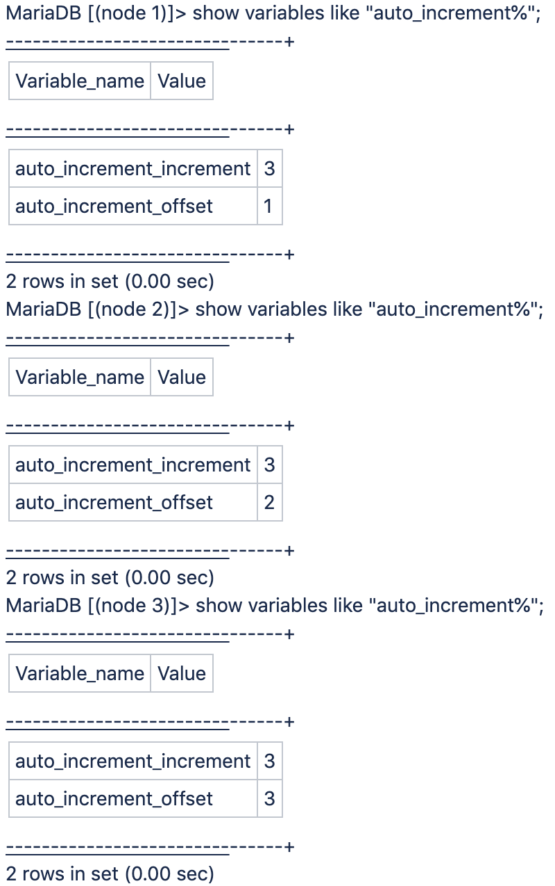

# Database auto_increment_ increment variable set to "3" Adobe Commerce on our cloud pro architecture

This is the expected behavior for Adobe Commerce on cloud infrastructure Pro plan architecture solutions due to the 3-node architecture and cannot be modified.

The Galera database cluster is used, which is a database cluster with one MariaDB MySQL database per node with an auto-increment setting of three for unique IDs across every database.

<ins>Why does the increment ID used on Pro clusters not always get separated/incremented by 3?</ins>

The increment ID used on clusters does not always get separated/incremented by 3 due to the way that Galera works.

Each of the three servers manages its own ID space, and the increment being used depends on which is the MySQL main database server (depending on the relative load) - hence the varying gaps.
If you SSH to each node and connect to the local MySQL instance running on that node using port 3307 (instead of being proxied to the "main" on the standard port 3306), you will see the following picture:

For example, if the elected main is node 1 where `auto_increment_offset = 1`, the ID would be incremented by 1. Then if a new main node gets elected at a later time, e.g., node 3 where `auto_increment_offset = 3`, it would be incremented by 3 instead.

## Useful links

See in our developer documentation:

* [Cloud for Adobe Commerce > Pro architecture > Backup and disaster recovery](https://devdocs.magento.com/cloud/architecture/pro-architecture.html#backup-and-disaster-recovery)
* [Cloud for Adobe Commerce > Install prerequisites: database](https://devdocs.magento.com/cloud/before/before-workspace-magento-prereqs.html#database)