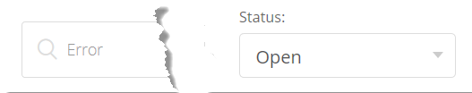
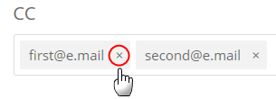
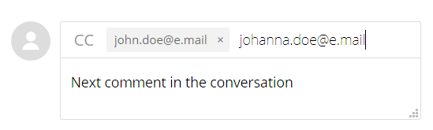

# Adobe Commerce Help Center User Guide

In this guide, learn how to submit a support ticket to the [Adobe Commerce Help Center](https://support.magento.com/hc/en-us) and provide shared access to the Adobe Commerce accounts.

>[!NOTE]
>
>Adobe Commerce support is moving from Adobe Commerce Help Center to Experience League. If you've been notified that you have access, use the Experience League case form flow described [here](#what-is-experience-support). If you haven't been notified, continue to use the [Adobe Commerce Help Center case flow](#what-is-adobe-commerce-help-center).

>[!NOTE]
>
>The Knowledge Base part of the Adobe Commerce Help Center has migrated to the Adobe Experience League portal. When you create a support ticket, related Knowledge Base articles will be suggested to you, along with other relevant Adobe Commerce documentation from Adobe Experience League.

**Major Update:** July 8, 2024

**[WHAT IS EXPERIENCE LEAGUE SUPPORT?](#what-is-experience-support)**

**[SUPPORT CASES](#support-cases)**

* [Sign in to Experience League Support](#sign-in-experience-support)
* [Submit a support case](#submit-case)

    * [Adobe Experience League start page](#experience-league-start-page)
    * [Adobe Commerce account page](#submit-case-adobe-commerce-account-page)
    * [*Please verify your email address* error on Adobe Commerce account page](#verify-email-address-error)

* [Track your support cases](#track-support-cases)
* [Comments in your case](#comments-in-your-case)
* [Close your case](#close-case)

**[WHAT IS THE ADOBE COMMERCE HELP CENTER?](#what-is-adobe-commerce-help-center)**

**[SUPPORT TICKETS](#support-tickets)**

* [Log In To Help Center](#login)
* [Submit a support ticket](#submit-ticket)

    * [Help Center start page](#submit-ticket-help-center-start-page)
    * [Magento Account page](#submit-ticket-magento-account-page)
    * [Cloud Console](#submit-ticket-magento-cloud-account-page)
    * [Information in your support ticket](#info-in-support-ticket)
    * ["Submit a ticket" link not displayed on Adobe Commerce Help Center start page](#no-submit-link)
    * [*"Please verify your email address"* error on Magento Account page](#verify-email-address)
    * [Ticket submission form: merchant is not displayed in Organization drop-down](#merchant-not-displayed)

* [Track your tickets](#track-tickets)
* [Adobe Commerce P1 hotline (Login Required)](#P1-hotline)
* [Adobe Commerce Shared Responsibility Operational Model (Login Required)](#shared-responsibility-operational-model)
* [Support ticket fields explained](#ticket-fields-explained)
* [Ticket status: How your requests are processed](#ticket-status)
* [Conversation in your ticket](#conversation-in-ticket)
* [Resolve your ticket](#resolve-ticket)
* [Open a follow-up ticket](#follow-up)

**[SHARED ACCESS: GRANT PRIVILEGES FOR OTHER USERS TO ACCESS YOUR ACCOUNT](#shared-access)**

* [Who can provide shared access](#who-can-provide-shared-access)
* [Provide shared access](#provide-shared-access)
* [Revoke (delete) shared access](#revoke-shared-access)

   * [How to delete users who were granted shared access via a Cloud project?](#remove-cloud-shared-access-users)

* [Access shared account (switch accounts)](#switch-accounts)
* [Shared access troubleshooting](#troubleshooting-shared-access)

**[BILLING FAQ FOR ADOBE COMMERCE](#billing-faq)**

**[MAGENTO U IS NOW PART OF ADOBE DIGITAL LEARNING SERVICES](#magento-u)**

>[!NOTE]
>
>Unless you have been notified, continue to use the [Adobe Commerce Help Center case flow](#what-is-adobe-commerce-help-center). If you have been notified that you are in the cohort with access, follow the Experience League case form flow described [below](#what-is-experience-league-support).

## WHAT IS EXPERIENCE LEAGUE SUPPORT? {#what-is-experience-support}

Experience League Support is a support portal for Adobe where qualifying Adobe Commerce customers can submit and manage support tickets. It is also where you can review troubleshooting articles.

## SUPPORT CASES {#support-cases}

Adobe Experience League Support Case Management allows working with support through cases to address specific issues encountered while using Adobe products, including Adobe Commerce, for all Adobe Commerce products under contract.

## SIGN IN TO EXPERIENCE LEAGUE SUPPORT {#sign-in-experience-support}

Signing in allows you to submit, update, and respond to questions from agents on support tickets.

To sign in to the Adobe Experience League Support, follow these steps:

1. Navigate to [experienceleague.adobe.com](https://experienceleague.adobe.com/).
1. Sign in using your Adobe login credentials.

### Submit a support case {#support-case}

Once successfully signed in, you may submit a support case using the Adobe Experience League homepage, your Adobe Commerce account page, and your Adobe Commerce Cloud account page.

* If you are the account owner, follow the steps below.
* If you are a Shared Access user, you must first switch accounts. See [Access shared account (switch accounts)](https://experienceleague.adobe.com/en/docs/commerce-knowledge-base/kb/help-center-guide/magento-help-center-user-guide#switch-accounts), and then you may proceed to the steps below.

#### Adobe Experience League start page {#experience-league-start-page}

To submit a new support case using the start page of Adobe Experience League, follow these steps:

>![NOTE]
>
>1. If you belong to multiple organizations, you will need to select the appropriate organization from the dropdown.
>1. To submit a case, you must be entitled to support. If you are not, a bar will appear at the top of the page informing you that you are not a support-entitled user in the organization.

1. Click on **Support** in the header. It will open the Support's homepage.

    

1. To begin the support intake process, click **[!UICONTROL Open Ticket]** on the left hand menu, or click **[!UICONTROL Get Started]** in *[!UICONTROL Open a support ticket]* card.

    

1. Select a product from the dropdown menu and provide a case title and description.

    

1. Adobe Experience League will suggest articles and best practices that can help you solve your case. If you still need direct support, you will need to provide some additional information before submitting your case.

    

1. Once you've filled in all the required information, click on **[!UICONTROL Submit case]**.

You must have an account on both https://account.adobe.com and https://account.magento.com to sign in to the Experience League to submit a support case. You won't be able to submit a support case until you are signed in.

>[!NOTE] 
>
>If you already have an account at https://account.magento.com but aren't able to sign in, you may not have registered for an account at https://account.adobe.com, which is required as of August 2022.
>
>To resolve this:
>1. Create an account at https://account.adobe.com using the same email address on your MAG ID.
>1. Go to https://account.magento.com to link your Adobe ID with the MAG ID.

#### Adobe Commerce account page {#submit-case-adobe-commerce-account-page}

To submit a new support ticket using your Adobe Commerce account page, follow these steps:

1. Sign in to your Adobe Commerce account. See [detailed instructions](https://experienceleague.adobe.com/docs/commerce-admin/start/commerce-account/commerce-account-create.html?lang=en#create-a-commerce-account) in our user guide.
1. Click the **Support** tab.    

   {width="800"}

1. The Adobe Experience League support page loads for you.
1. Select **[!UICONTROL Open Ticket]** from the left-hand menu.
1. Fill in the fields.
1. Click **Submit**.

#### *Please verify your email address* error on Adobe Commerce Account page {#verify-email-address-error}

You won't be able to submit a support ticket if you receive the Please verify your email address error similar to the one below on the [Adobe Commerce account](https://account.magento.com/) page.

### Track your support cases {#track-support-case}

Your support cases are those that you:

* have submitted personally.
* have been added to as a watcher through a CC (carbon copy).

#### View your cases

You can view your cases by clicking **[!UICONTROL My Cases]** on the left-hand menu.

#### Search for cases

To find cases, type your search query in the *[!UICONTROL Search]* field and press *enter* on your keyboard.

#### Escalate your cases

If you feel that a case requires further attention and our initial response time has passed, you may escalate the case. To do that,

1. Click on **[!UICONTROL Escalate to management]** at the bottom right of the *[!UICONTROL Case Detail]* panel on the right side of the screen.

    

1. After clicking, a pop-up form will appear. Fill out the form and then click **[!UICONTROL Escalate]**.

    

    *Reasons for escalation may include*: Agent Communication Skills, Agent Technical Knowledge, Awaiting Callback/Update, Change in Issue Urgency, Resolution did not meet expectations, or Time to Resolution.

#### Add a watcher on support cases

You can add watchers to support cases submitted by members of your organization. Watchers will receive email notifications when new cases are submitted or when existing cases are updated.

1. To add a watcher to an existing case, open the case and click on the pencil icon next to "watchers" in the Case Details panel on the right side of the screen.

    

1. After clicking on the pencil, you can add or remove watchers from the list.

    

### Comments in your case {#comments-in-your-case}

Comments in your case contain all comments written by you or the Adobe Commerce support team. Comments are displayed from latest (on top) to earliest (bottom).
To add a comment, follow these steps:

1. Scroll to the bottom of your ticket.
1. Write your comment in the **[!UICONTROL Comments]** field and click **[!UICONTROL Add comments]**.

### Close your case {#close-case}

To close your case, click **[!UICONTROL Close case]** at the bottom right of the *[!UICONTROL Case Detail]* panel.

>[!NOTE]
>
>Continue using the Adobe Commerce Help Center form flow [below](#what-is-adobe-commerce-help-center) for ticket submission and management unless you have been notified that you are in the cohort with access to the Experience League case form flow described [here](#what-is-experience-league-support). 

## WHAT IS ADOBE COMMERCE HELP CENTER? {#what-is-adobe-commerce-help-center}

The [Adobe Commerce Help Center](https://support.magento.com/hc/en-us) is a support portal for Adobe Commerce, where qualifying customers can submit and manage support tickets. It is also where you can review troubleshooting articles.

## SUPPORT TICKETS {#support-tickets}

Adobe Commerce Ticketing System allows working with support tickets to address the particular issues you are experiencing while working with Adobe Commerce &ndash; for all Adobe Commerce products.

## LOG IN TO HELP CENTER {#login}

Logging in allows you to submit, update, and respond to questions from agents on support tickets.

To log in to the Adobe Commerce Help Center, follow these steps:

1. Access the Help Center at <https://support.magento.com>.
1. Click **Log In** in the upper-right corner.

Use your Magento Account credentials to log in. For more information, see [Your Magento Account](https://experienceleague.adobe.com/docs/commerce-admin/start/commerce-account/commerce-account-create.html) in our user guide.

### <strong>Submit a support ticket</strong> {#submit-ticket}

Once successfully logged in, you may submit a support ticket using the Help Center start page, your Magento Account page, and your Magento Cloud Account page.

* If you are the **Account Owner** follow the steps below.
* If you are a **Shared Access user, you must switch accounts first** [Access shared account (switch accounts)](#switch-accounts), and then you may proceed to the steps below.

#### Help Center start page {#submit-ticket-help-center-start-page}

To submit a new support ticket using the starting page of Adobe Commerce Help Center, follow these steps:

1. Go to [Adobe Commerce Help Center](https://support.magento.com/hc/en-us).
1. Click **Submit a ticket** at the upper-right corner.

   {width="800"}

1. Fill in the fields.
1. Click **Submit**.

You *must have* an account on both https://account.adobe.com and https://account.magento.com and then log in to the Help Center using your Adobe Commerce account in order to submit a support ticket. Until you are logged in, [the **Submit a ticket** button will not be displayed](#no-submit-link).

>[!NOTE] 
>
>If you already have an account at https://account.magento.com but aren't able to log in, you may not have registered for an account at https://account.adobe.com, which is required as of August 2022.
>
>To resolve this:
>1. Create an account at https://account.adobe.com using the same email address on your MAG ID.
>1. Go to https://account.magento.com to link your Adobe ID with the MAG ID.

#### Magento Account page {#submit-ticket-magento-account-page}

To submit a new support ticket using your Magento Account page, follow these steps:

1. Log in to your Magento Account. See [detailed instructions](https://experienceleague.adobe.com/docs/commerce-admin/start/commerce-account/commerce-account-create.html?lang=en#create-a-commerce-account) in our user guide.
1. Click the **Support** tab.    

   {width="800"}

1. The Help Center start page loads for you.
1. Click **Submit a ticket** in the upper-right corner.
1. Fill in the fields.
1. Click **Submit**.

#### Cloud Console {#submit-ticket-magento-cloud-account-page}

To submit a new support ticket using the Cloud Console, follow these steps:

1. Log in to the [Cloud Console](https://console.adobecommerce.com).
1. Select **[!UICONTROL Support]** in the user menu.
1. The **[!UICONTROL My Tickets]** page loads.
1. Click **[!UICONTROL Submit a ticket]** in the upper-right corner.
1. Fill in the fields.
1. Click **Submit**.
1. Click **[!UICONTROL Submit]**.

#### Information in your support ticket {#info-in-support-ticket}

The fields, marked with a red asterisk ( **\*** ), are required and must be filled in. If you leave any of those fields empty, you will not be able to submit your ticket.

See [Ticket fields explained](#ticket-fields-explained) below for more detailed information.

### "Submit a ticket" link not displayed on Adobe Commerce Help Center start page {#no-submit-link}

#### Issue

You access the Adobe Commerce Help Center and want to submit a support request, but the **Submit a ticket** link is not displayed on the Help Center start page.

#### Cause

One of the following might be the cause:

* You have not logged in to the Help Center.
* If using shared access for the first time, you have not performed the steps required to ensure that Adobe Commerce Help Center is configured properly via the SSO call from Magento.com.
* Your account is not entitled for Adobe Commerce support (for example, you are not a paying Commerce customer or you are an Open Source customer).

#### Solution

[Log in to Help Center](/help/help-center-guide/help-center/magento-help-center-user-guide.md#provide-shared-access).

The **Submit a ticket** link will only be displayed for customers with an email linked to a valid support agreement.

#### Using shared access account

To be able to use shared access account to submit support tickets, you need to perform the following (this needs to be done only once):

1. After receiving [shared access](https://support.magento.com/hc/en-us/articles/360052444712#who-can-provide-shared-access), log in to your [Magento Account on the magento.com website](https://account.magento.com/).
1. In the **Switch Accounts** drop-down field in top-right corner, select the shared access account.
1. Click on the **Support** tab in the left panel. Doing this will ensure that the Adobe Commerce Help Center is configured properly via the SSO call from Magento.com to Adobe Commerce Help Center.

#### Still don't see the **Submit a ticket** link

If you don't have **Shared Accounts** under the **Switch Accounts** drop-down list, but you are working for a client who has an Adobe Commerce license, please ask them to grant you Shared Access. For more details review [Provide shared access to Magento Account](/help/help-center-guide/help-center/magento-help-center-user-guide.md#provide-shared-access).

If you are an Adobe Commerce license owner, please verify that you don't have an invoice with **Pending Payment** status. Support entitlements are automatically granted or revoked according to invoice payment status.

How To Check Your Payment Status:

1. Log in to [magento.com](https://support.magento.com/).
1. Click on **Billing History** on the left.
1. If you **do** have an invoice with **Pending Payment** status, **please contact your Adobe Account Team** to have the payment issue resolved.

We provide support only to Adobe Commerce license owners and accounts which have Shared Access to an account with an Adobe Commerce license. If you need support for the Magento Open Source edition, please utilize these self-help technical resources:

* [Adobe Commerce Help Center](https://support.magento.com/)
* [Adobe Commerce Developer Documentation](https://developer.adobe.com/commerce/docs/)
* [Adobe Commerce documentation resources](https://experienceleague.adobe.com/docs/commerce.html)
* [Magento Forums](https://community.magento.com/?_ga=2.99592990.1084044056.1559046120-720752292.1551793747)

If you are having issues logging in to your account or believe Shared Access was set up correctly, but you still cannot see **Submit a ticket** button, please email [Help Center login issues](mailto:grp-magento-helpcenterloginissues@adobe.com), and we will gladly review your account settings and support entitlements.

>[!NOTE]
>
>If you are having an issue with accessing your cloud project, submit the ticket for this issue through the regular channels. Do not send an email if you are able to submit a ticket.

### "Please verify your email address" error on the Magento Account page {#verify-email-address}

You won't be able to submit a support ticket if you receive the *Please verify your email address* error similar to the one below on the [Magento Account page](https://account.magento.com/).

{width="800"}

The solution is to validate your email address:

1. Log in to https://account.adobe.com and request a password if needed.
1. Verify your Adobe account.

>[!NOTE]
>
>This only applies to the email validation link from https://account.magento.com (Magento Account page).

### Ticket submission form: merchant is not displayed in Organization drop-down {#merchant-not-displayed}

#### Issue

Prerequisites: you have a shared access account granted by a merchant.

Steps to reproduce:

1. Log in to the Help Center using your shared account.
1. Click the **Submit a ticket** link. The ticket submission form opens.
1. Expand the **Organization** drop-down field to select the merchant.

Expected result:

The merchant corresponding to the shared account is listed in the **Organization** options.

Actual result:

The merchant corresponding to the used shared account is not available in the **Organization** options.

#### Solution

After having been granted shared access from the merchant, you need to take the following steps (only once):

1. Log in to your [Magento Account on the magento.com website](https://account.magento.com/).
1. In the **Switch Accounts** drop-down field at the top-right corner, select the shared access account.
1. Click on the **Support** tab in the left panel. Doing this will ensure that the Adobe Commerce Help Center is configured properly via the SSO call from Magento.com to Adobe Commerce Help Center.

If you have already done this, check if you have been granted *shared access from more than one merchant* by clicking on the [[!UICONTROL Shared with me] tab on your account](https://account.magento.com/grantor/manage/shared/):
* If only one [!UICONTROL Share Name] is listed, i.e., you have only been granted by one merchant, *you will not see an [!UICONTROL Organization] drop-down*.
* If there are multiple [!UICONTROL Share Names], the merchant's support entitlements may have expired because their license was previously revoked due to payment issues.

### Track your tickets {#track-tickets}

Your tickets are those that you:

* have submitted personally
* have been added to as a watcher through a CC (carbon copy)

#### View your tickets

To list all your tickets, click your profile menu (upper-right corner) on the Help Center start page and select **My tickets**.

{width-"800"}

To switch between your tickets and the tickets you have been CC'd on, click the corresponding tab:

* **My tickets**
* **Tickets I'm CC'd on**
* **Organization tickets** (available if your account is associated with several organizations)

To sort tickets, click **Created** or **Last Activity** column headers.

#### Search for tickets

To find tickets, type your search query in the **Search tickets** field and press *Enter* on your keyboard. Select [a status](#ticket-status) for additional filtering.

#### Follow organization tickets

You may follow the support tickets submitted by the members of your organization.

When you follow your organization tickets, you:

* may view tickets within the **Organization tickets** tab
* receive email notifications when the new tickets are submitted, or the existing tickets are changed

To follow/unfollow tickets for an organization:

1. Go to **My tickets** > **Organization tickets** tab.
1. Select an organization in the menu and click **Follow/Unfollow**.

### Adobe Commerce P1 hotline {#P1-hotline}

**Login is required** to access the [Adobe Commerce P1 hotline](https://experienceleague.adobe.com/docs/commerce-knowledge-base/kb/how-to/adobe-commerce-p1-notification-hotline.html) article which provides the P1 hotline numbers for Adobe Commerce when seeking help during a P1 incident and explains what information to provide.

### Adobe Commerce Shared Responsibility Operational Model {#shared-responsibility-operational-model}

See the article on [Adobe Commerce Shared Responsibility Operational Model](https://experienceleague.adobe.com/en/docs/commerce-operations/security-and-compliance/shared-responsibility#operational-responsibilities-summary), 
which aims to clarify operational responsibilities for our Pro infrastructure offering only.

### Support ticket fields explained {#ticket-fields-explained}

#### Affected URL

Link to the environment where the Adobe Commerce support team would be able to see your problem. Make sure to start the URL with "http://" or "https://".

#### Attachments

Attach logs, screenshots, video recordings, or any other media that may better illustrate your problem.

#### Backoffice URL (MOM only)

URL must begin with "https://". It will typically be in the format: merchant name +".mcom.magento.com/admin/login", example, "https://luma.mcom.magento.com/admin/login".

You can also put the direct link related to your issue.

#### CC

Emails of the persons whom you want to follow your ticket (for example, *first@e.mail*).

You may add emails of the persons who do not have a Magento Account or a Zendesk account; these persons are still able to contribute to the conversation in your ticket.

To add several emails to CC:

>[!NOTE]
>
>The user in CC: must have an existing account at https://account.magento.com. If not, they must first create one at https://account.adobe.com and log in to https://account.magento.com with that account.

1. Enter the email.
1. Press *Space* on your keyboard to save the entered email. The email appears in a gray frame.    
        
1. Start typing the next email.
1. Save all other emails by pressing *Space*.

To delete emails from CC: click **x** in a framed email.

#### Product

Select the type of Adobe Commerce product you are working with:

* Adobe Commerce: The **[!UICONTROL Implementation Type]** field will appear after you've selected this option (see below for details)
* Magento Order Management
* Adobe Commerce Reporting: Not including [Advanced Reporting](https://experienceleague.adobe.com/docs/commerce-admin/config/general/advanced-reporting.html)
* Adobe Commerce [Payment Services](https://experienceleague.adobe.com/docs/commerce-merchant-services/payment-services/overview.html)
* Adobe Commerce Services: [Channel Manager](https://experienceleague.adobe.com/docs/commerce-channels/channel-manager/guide-overview.html) only

#### Implementation Type

This field will only appear after you've selected **[!UICONTROL Product]** = *Adobe Commerce*

Please specify your deployment method:

* Cloud: Choose this only if you are on Adobe Commerce on Cloud Infrastructure
* On-premises: *All self-hosted instances as well as [AWS] cloud-based hosting* (excludes Adobe Commerce on Cloud)

#### Cloud Project URL

Please provide the URL for the Cloud Console project, for example, `https://console.adobecommerce.com/<owner-user-name>/<project-ID>`.

Another method to obtain the Project URL is as follows:

1. Log in to the [Cloud Console](https://console.adobecommerce.com).
1. Click on the appropriate project.
1. Copy the URL.

#### Contact reason

Contact reasons vary by product. Choose which contact reason best fits the symptoms you are experiencing. Refer to the [Support ticket Contact Reason descriptions](/help/faq/general/support-ticket-contact-reason-descriptions.md) article to learn more about what contact reason you should choose.

#### Adobe Commerce Environment ID

This field will only appear after you've selected **[!UICONTROL Contact Reason]** = *Adobe Commerce Cloud Application*, followed by **Adobe Commerce Application Contact Reason** = *[!DNL Live Search]*.
Go to **[!UICONTROL System]** > **[!UICONTROL Services]** > **[!UICONTROL Commerce Services Connector]** > **[!UICONTROL SaaS Identifier]**, and provide the *[!UICONTROL Data Space ID]*.

#### (Data) Integration type (Adobe Commerce Reporting only)

Select the type of integration you have within Adobe Commerce Reporting. This will help our engineers to more efficiently solve your issue.

#### Description

Include an overview of your problem with as many details as you find reasonably possible.

Please provide precise details, steps to reproduce (except for Adobe Commerce on-premises and cloud infrastructure, where there is a separate [Steps to Reproduce](#steps) field), and symptoms of your issue or request. Be sure to include any affected SKUs, relevant data points, and any other relevant links.

#### Environment (Adobe Commerce on cloud infrastructure, Adobe Commerce on-premises, Adobe Commerce Reporting and Shipping only)

Select the **environment type** on which you face the problem:

* Development (**Integration branches**)
* Staging
* Production

Read more about Adobe Commerce on cloud infrastructure environments in the [Pro architecture](https://experienceleague.adobe.com/docs/commerce-cloud-service/user-guide/architecture/pro-architecture.html) article in our user guide.

#### Number of orders affected (MOM only)

Select the range of orders that are affected.

This is a drop-down and only applicable for Order Management product.

#### Organization

Indicate the organization you would like your ticket to be associated with &ndash; in case you work with several organizations.

This field appears when your account is associated with more than one organization.

>[!WARNING]
>
>You must ensure that you have selected the correct organization. A third party who is not related to the organization would be able to view potentially sensitive and proprietary information, if you select the wrong organization.

>[!NOTE]
>
>Organization can be changed after the ticket is submitted. Follow these steps to change the organization.
>
>1. Go to the right column of the ticket.
>1. Locate the dropdown for available organizations.
>1. Select the appropriate organization.
>
>

In addition, this would allow us to quickly cross reference similar/duplicated/related tickets submitted for this organization in the past and identify clues that might help with investigating and resolving the current ticket.

If you do have Shared Access to multiple organizations but this field is not available, refer to [Ticket submission form: merchant is not displayed in Organization drop-down](https://experienceleague.adobe.com/docs/commerce-knowledge-base/kb/help-center-guide/magento-help-center-user-guide.html#merchant-not-displayed)

#### Partner name (Merchant name)

For Merchants: **Partner Name** is the name of the Development Organization (Adobe Commerce [Technology Partner](https://partners.magento.com/portal/directory/?&partner_type=6) or [Solution Partner](https://partners.magento.com/portal/directory/?&partner_type=1)) that participate in developing your Adobe Commerce store.

For Partners: **Merchant Name** is the name of your Customer.

#### Project URL (Commerce Cloud only)

Link to the [Cloud Console](https://experienceleague.adobe.com/docs/commerce-cloud-service/user-guide/project/overview.html).

#### Steps to reproduce (Adobe Commerce on-premises and Adobe Commerce on cloud infrastructure only)

Give exact step-by-step instructions to reproduce your problem, including:

* Steps to replicate
* Expected result
* Actual result

*Recommendation:* Assume that you are writing these steps for someone who knows **nothing** about Adobe Commerce:

* Mention every step, even if it seems simple and obvious
* Do not rely on the assumption that your reader knows what you mean

Write in simple language, with short sentences.

#### Subject

Include a short overview of your problem (for example, *Error 404 on all pages*).

**Suggested articles:** When you input the search term, a list of Adobe Commerce documentation articles that might be related to your problem display. Click an article in the list to open it.

*Recommendation:* Please carefully consider the proposed articles, they might contain the solution you are expecting to receive from the Adobe Commerce support team.

#### Version (Adobe Commerce on-premises, Adobe Commerce on cloud infrastructure and Shipping only)

Please select the Adobe Commerce version you are requesting help with. All supported versions of Adobe Commerce are listed at the top. Unsupported versions are listed at the bottom with parentheses. If you are in the process of migration, please select the latest version to ensure you are supported.

To find the version of your Adobe Commerce (cloud infrastructure), scroll down the [Cloud Console](https://experienceleague.adobe.com/docs/commerce-cloud-service/user-guide/project/overview.html) page and check the lower-middle of the window.

If you are using [Elasticsearch](https://experienceleague.adobe.com/docs/commerce-operations/installation-guide/prerequisites/search-engine/overview.html) or [OpenSearch](https://experienceleague.adobe.com/docs/commerce-operations/installation-guide/prerequisites/search-engine/aws-opensearch.html), do not select this option.

To obtain this information, in the Adobe Commerce Admin, go to **Marketing** > **Live Search** > **GraphQL Playground**, scroll down to the bottom of the page, then click on **HTTP HEADERS**.

### Ticket status: How your tickets are processed {#ticket-status}

Your ticket may have either of these three statuses.

#### **1. Open**

Your ticket is not solved and is being processed by the Adobe Commerce support team. When you have provided all the info that is expected from you at a particular step in the conversation, and the next step needs to be taken by Adobe Commerce support, your ticket has the **Open** status.

#### **2. Awaiting your reply**

Adobe Commerce support is expecting information from you.

In your reply, you may specify additional technical details of your issue, provide escalation details, or state if the solution, offered by Adobe Commerce support, has proved helpful for your issue. Make sure you provide your replies as soon as you can since Adobe Commerce support cannot proceed with processing your ticket while it is in the **Awaiting your reply** status.

Reference the [Adobe Commerce support ticket lifecycle policy update](/help/help-center-guide/help-center/magento-support-ticket-lifecycle-policy-update.md) article for details about timing and notification policy.

#### **3. Solved**

Adobe Commerce support has provided a solution for your issue, and you have agreed it has been helpful. It is you who marks the ticket as **Solved**. If the fixed issue occurs again, you may reopen the ticket, setting its status to back to **Open**.

### Conversation in your ticket {#conversation-in-ticket}

Conversation in your ticket unites all comments written by you or the Adobe Commerce support team. Comments are displayed from latest (on top) to earliest (bottom).

To add a comment to the conversation, follow these steps:

1. Scroll to the bottom of your ticket.
1. Click the **Add to conversation** field to start writing.

    

1. To add a person to your comment, specify the email in the **CC** field of the comment field.

   >[!NOTE]
   >
   >The user in CC: must have an existing account at https://account.magento.com. If not, they must first create one at https://account.adobe.com and log in to https://account.magento.com with that account.
    
    

1. Once you are finished with your comment, click **Submit**.

### Resolve your ticket {#resolve-ticket}

To resolve your ticket, click **Mark as solved** at the bottom of your ticket.

### Open a follow-up ticket {#follow-up}

Opening a follow-up ticket will ensure that the original issue is linked to the follow-up ticket for continuity.

To open a follow-up ticket, click the "*create a follow-up*" link at the bottom of the ticket you wish to create a follow up to.

## SHARED ACCESS: GRANT PRIVILEGES FOR OTHER USERS TO ACCESS YOUR ACCOUNT {#shared-access}

You may grant limited access to your account for other Adobe Commerce account holders. In particular, using the **shared access** functionality, you may provide privileges for trusted employees and service providers to use your Help Center account so that they could work with your support tickets.

You can provide and manage shared access using your Adobe Commerce account page at [https://account.magento.com](https://account.magento.com/).

### Who can provide shared access {#who-can-provide-shared-access}

Only the account owner (primary account holder) with the according privileges can provide shared access for other users.

Managing users and their access is the customer's responsibility, especially in the shared access perspective. Thus, the Adobe Commerce support team cannot provide shared access to an Adobe Commerce account on behalf of a Customer. Customers are encouraged to add users with shared access themselves, using the [Adobe Commerce account page](https://account.magento.com/).

Users who have been provided with shared access cannot transfer or grant such access to other users.

### Provide shared access {#provide-shared-access}

See the [Share a Commerce account](https://experienceleague.adobe.com/en/docs/commerce-admin/start/commerce-account/commerce-account-share) section of Adobe Commerce Getting Started Guide for detailed steps on setting up a shared account.

After providing shared access for a new user, the related information is available in **Shared Access** > **Manage Permissions** of your Adobe Commerce account page.

### Revoke (delete) shared access {#revoke-shared-access}

1. Log in to your Adobe Commerce account at [https://account.magento.com](https://account.magento.com/).
1. In the panel on the left, under Shared Access, choose **Manage Permissions.**
1. Find the user to revoke shared access from and click {width="25"} in the user's row (**Actions** column).
1. Click **Delete User** to revoke access or X in the top corner to cancel revoking.

   {width="800"}

   You may also revoke shared access using the **Edit** menu:

1. Log in to your Adobe Commerce account at [https://account.magento.com](https://account.magento.com/).
1. In the panel on the left, under Shared Access, choose **Manage Permissions.**
1. Find the user to revoke shared access from and click **Edit** in the user's row (**Actions** column).
1. Click **Delete This User** at the bottom of the page.
1. In the confirmation popup, click **Delete User** to revoke access or X in the top corner to cancel revoking.

### How to delete users who were granted shared access via a Cloud project? {#remove-cloud-shared-access-users}

<u>Affected products and versions</u>

* Adobe Commerce Cloud (all versions)

<u>Cause</u>

If you have/had an Adobe Commerce Cloud project and had added a user to the project, they would have been automatically granted Shared Access on the Project Owner's MAGE ID. This would normally be indicated in the **[!UICONTROL Share Name]** column, showing *Cloud Shared Access from MAG[XYZ]*.

If the DELETE link is missing, that means that Shared Access was automatically granted through Commerce Cloud.

<u>Solution</u>

It's not possible to delete the list of Shared Access users with the Share Name of *Cloud Shared Access from MAG[XYZ]* if the Shared Access wasn't added/given on this page. These are retained for informational/audit purposes.

However, once you have revoked the permissions on those Shared Access users, they will no longer have that access.

1. Log in to your Adobe Commerce account at [https://account.magento.com](https://account.magento.com/).
1. In the panel on the left, under *[!UICONTROL Shared Access]*, choose **[!UICONTROL Manage Permissions]**.
1. Find the user to revoke shared access from and click **[!UICONTROL Edit]** in the user's row (*[!UICONTROL Actions]* column).
1. Uncheck all resources under *[!UICONTROL Grant Account Permissions]*.

{width="800"}

For more information, please refer to the [Manage User Access](https://experienceleague.adobe.com/docs/commerce-cloud-service/user-guide/project/user-access.html#manage-users-from-the-project-web-interface) documentation on our Commerce on Cloud Infrastructure Guide.

### Access shared account (switch accounts) {#switch-accounts}

To use the shared access provided for you, follow these steps:

1. Log in to your Adobe Commerce account at [https://account.magento.com](https://account.magento.com/).
1. Click the **Switch Accounts** menu and select an account.

   {width="800"}

To know which account you are currently using (your own native account or shared access), see the **Switch Accounts** menu: it displays the active account.

### Shared access troubleshooting {#troubleshooting-shared-access}

Please refer to the [Shared access troubleshooting article](/help/troubleshooting/miscellaneous/shared-access-troubleshooting.md) in our support knowledge base.

## BILLING FAQ FOR ADOBE COMMERCE {#billing-faq}

Merchants typically pay for our services by a credit card (CC) transaction, and this [Billing FAQ for Adobe Commerce](/help/faq/general/billing-faq-for-adobe-commerce.md) is a resource to assist you when you pay your bill.

## MAGENTO U IS NOW PART OF ADOBE DIGITAL LEARNING SERVICES {#magento-u}

Magento U has merged with [Adobe Digital Learning Services (ADLS)](https://learning.adobe.com/).

