# Experience League Support User Guide for Adobe Commerce 

In this guide, learn how to submit a support ticket to [Experience League Support](https://experienceleague.adobe.com/home#support) and provide shared access to the Adobe Commerce accounts.

>[!NOTE]
>
>Adobe Commerce support has migrated from Adobe Commerce Help Center to Experience League. Use the Experience League case form flow described [here](#what-is-experience-support) to submit support cases.

>[!NOTE]
>
>The Knowledge Base part of the Adobe Commerce Help Center has migrated to the Adobe Experience League portal. When you create a support ticket, related Knowledge Base articles will be suggested to you, along with other relevant Adobe Commerce documentation from Adobe Experience League.

**Major Update:** July 29, 2024

**[WHAT IS EXPERIENCE LEAGUE SUPPORT?](#what-is-experience-support)**

**[SUPPORT CASES](#support-cases)**

* [Sign in to Experience League Support](#sign-in-experience-support)
* [Submit a support case](#submit-case)

    * [Adobe Experience League start page](#experience-league-start-page)
    * [Adobe Commerce account page](#submit-case-adobe-commerce-account-page)
    * [*Please verify your email address* error on Adobe Commerce account page](#verify-email-address-error)

* [Track your support cases](#track-support-cases)
* [Comments in your case](#comments-in-your-case)
* [Close your case](#close-case)
* [Reopen your case](#reopen-case)
* [Submit ticket using Cloud Console](#cloud-console)
* [Adobe Commerce P1 hotline](#P1-hotline)
* [Adobe Commerce Shared Responsibility Operational Model](#shared-responsibility-operational-model)

**[SHARED ACCESS: GRANT PRIVILEGES FOR OTHER USERS TO ACCESS YOUR ACCOUNT](#shared-access)**

* [Who can provide shared access](#who-can-provide-shared-access)
* [Provide shared access](#provide-shared-access)
* [Revoke (delete) shared access](#revoke-shared-access)

   * [How to delete users who were granted shared access via a Cloud project?](#remove-cloud-shared-access-users)

* [Access shared account (switch accounts)](#switch-accounts)
* [Shared access troubleshooting](#troubleshooting-shared-access)

**[BILLING FAQ FOR ADOBE COMMERCE](#billing-faq)**

## WHAT IS EXPERIENCE LEAGUE SUPPORT? {#what-is-experience-support}

Experience League Support is a support portal for Adobe where qualifying Adobe Commerce customers can submit and manage support tickets. It is also where you can review troubleshooting articles.

## SUPPORT CASES {#support-cases}

Adobe Experience League Support Case Management allows working with support through cases to address specific issues encountered while using Adobe products, including Adobe Commerce, for all Adobe Commerce products under contract.

## SIGN IN TO EXPERIENCE LEAGUE SUPPORT {#sign-in-experience-support}

Signing in allows you to submit, update, and respond to questions from agents on support tickets.

To sign in to the Adobe Experience League Support, follow these steps:

1. Navigate to [experienceleague.adobe.com](https://experienceleague.adobe.com/).
1. Sign in using your Adobe login credentials.

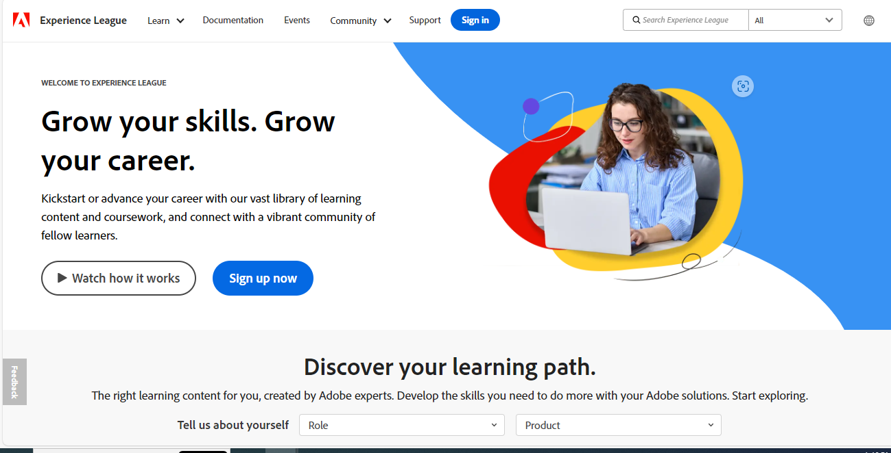

### Submit a support case {#support-case}

Once successfully signed in, you may submit a support case using the Adobe Experience League homepage, your Adobe Commerce account page, and your Adobe Commerce Cloud account page.

* If you are the account owner, follow the steps below.
* If you are a Shared Access user, you must first switch accounts. See [Access shared account (switch accounts)](https://experienceleague.adobe.com/en/docs/commerce-knowledge-base/kb/help-center-guide/magento-help-center-user-guide#switch-accounts), and then you may proceed to the steps below.

#### Adobe Experience League start page {#experience-league-start-page}

To submit a new support case using the start page of Adobe Experience League, follow these steps:

>[!INFO]
>
>1. To submit a case, you must be entitled to support for the appropriate product (e.g., Adobe Commerce, Adobe Commerce Intelligence, Experience Platform, etc.). If you aren't entitled to support, a bar will appear at the top of the page informing you that you are not a support-entitled user in the organization. 
>1. If you belong to multiple organizations or there are multiple organizations with similar-looking names (each one will represent any of the other Adobe products the organization has subscriptions to), you will need to first select the appropriate organization from the dropdown. 

>[!NOTE]
>
>Ensure that you have selected the correct organization before submitting the case, and that the organization you selected has the appropriate entitlements for the product for which you are requesting support. For example, if your issue is related to Adobe Commerce, but you had selected Experience Platform as the product and the case was successfully submitted, this may lead to misrouting of your case and delays in response times. 
>
>In addition, if the wrong organization has been selected, your team will not be able to view the case under [!UICONTROL My Cases] for the appropriate/correct organization. The support team does not have the ability to change the organization associated with the case in the future.

1. Click on **Support** in the header. It will open the Support homepage.

    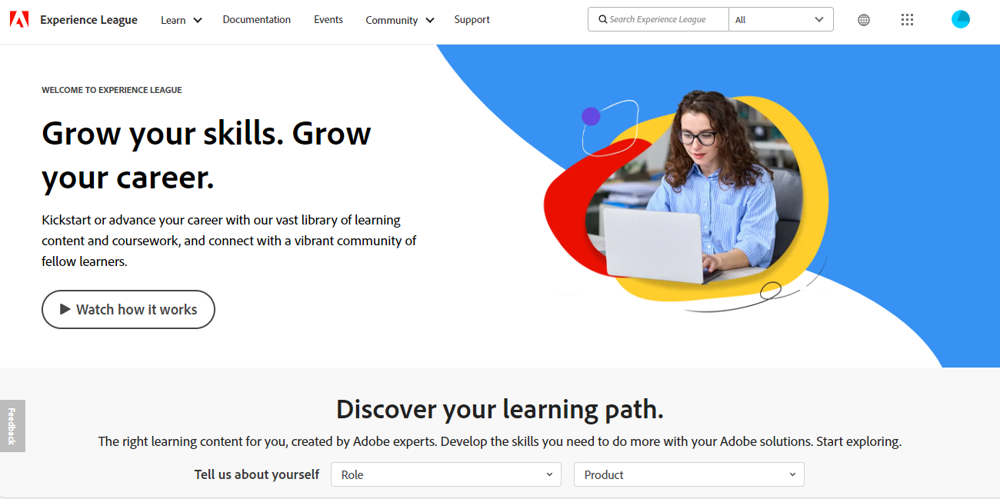

1. To begin the support intake process, ensure that you have selected the appropriate organization from the Organization dropdown list (if visible).

   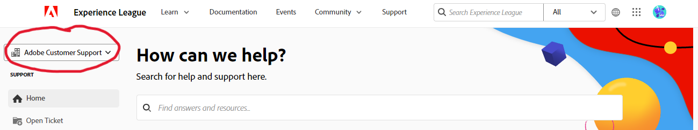

1. Click **[!UICONTROL Open Ticket]** on the left-hand menu or click **[!UICONTROL Get Started]** in *[!UICONTROL Open a support ticket]* card.

    

1. Select a product from the dropdown menu and provide a case title and description. NOTE: If the dropdown does not display any products or Commerce is not an available option, try switching the Organization in the left column and check again.

    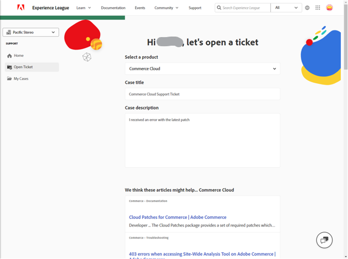

1. Adobe Experience League will suggest articles and best practices that can help you solve your case. If you still need direct support, you will need to provide some additional information before submitting your case.

    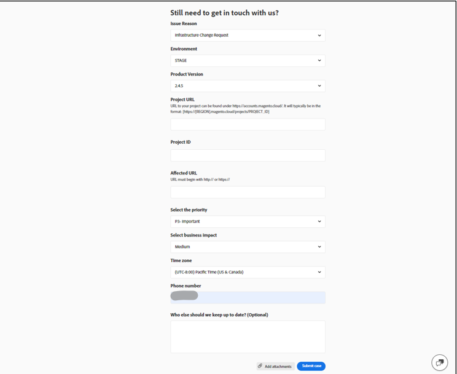

1. Once you've filled in all the required information, click on **[!UICONTROL Submit case]**.

>[!IMPORTANT]
>
>If you are unable to see your organization in the organization dropdown menu when you sign in to experienceleague.adobe.com, you may need to synchronize your profile with accounts.magento.com prior to requesting support or managing an existing support case.   
>
>1. Navigate to accounts.magento.com and sign in with the same profile (corporate, school, or personal) you will be using to manage support cases in Adobe Experience League. 
>1. Once you have successfully signed in to your accounts.magento.com profile, navigate back to experienceleague.adobe.com and sign in. 
>1. Select your organization from the organization dropdown menu. 
>1. If your organization still does not appear, contact your Commerce administrator to obtain support delegate rights. For additional information, see the [Commerce Account Share](https://experienceleague.adobe.com/en/docs/commerce-admin/start/commerce-account/commerce-account-share) help article. 

>[!NOTE]
>
>Why the Organization/Product matters
>
>**Example A**: You have shared access to only one company and that company has entitlements for two Adobe products: Product1 and Product2.
>1. Since each Organization represents one product, you will see two organizations in the dropdown, e.g., OrgA-Product1 and OrgB-Product2.
>1. If you selected Product = Product1 but your issue is related to Product2, the case will be routed to Product2 support and there will be delays when transferring the case to Product1 support.
>1. If you submitted the case for OrgA-Product1 and would like to review [!UICONTROL My Cases] for that Organization in the future, you will not see it if you select OrgA-Product2 as the Organization (you would just have to select the other Organization, compared with Example B).
>
>**Example B**: You have Shared Access to two companies, and each company only has entitlements for Adobe Commerce.
>1. If you submitted the case for OrgA but the issue is actually impacting OrgB, members of OrgB will not be able to see this case under [!UICONTROL My Cases] in the future. 
>1. In addition, members of OrgA will be able to see cases under [!UICONTROL My Cases] that are actually meant for OrgB, which can lead to privacy issues.

You must have an account on both https://account.adobe.com and https://account.magento.com to sign in to the Experience League to submit a support case. You won't be able to submit a support case until you are signed in.

>[!NOTE] 
>
>If you already have an account at https://account.magento.com but aren't able to sign in, you may not have registered for an account at https://account.adobe.com, which is required as of August 2022.
>
>To resolve this:
>1. Create an account at https://account.adobe.com using the same email address on your MAG ID.
>1. Go to https://account.magento.com to link your Adobe ID with the MAG ID.

#### Adobe Commerce account page {#submit-case-adobe-commerce-account-page}

To submit a new support ticket using your Adobe Commerce account page, follow these steps:

1. Sign in to your Adobe Commerce account. See [detailed instructions](https://experienceleague.adobe.com/docs/commerce-admin/start/commerce-account/commerce-account-create.html?lang=en#create-a-commerce-account) in our user guide.
1. Click the **Support** tab.    

   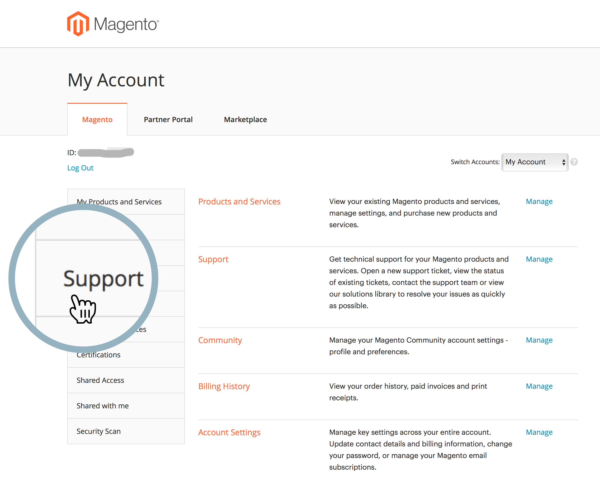{width="800"}

1. The Adobe Experience League support page loads for you.
1. Select **[!UICONTROL Open Ticket]** from the left-hand menu.
1. Fill in the fields.
1. Click **Submit**.

#### *Please verify your email address* error on Adobe Commerce Account page {#verify-email-address-error}

You won't be able to submit a support ticket if you receive the Please verify your email address error similar to the one below on the [Adobe Commerce account](https://account.magento.com/) page.

### Track your support cases {#track-support-case}

Your support cases are those that you:

* have submitted personally.
* have been added to as a watcher through a CC (carbon copy).

#### View your cases

You can view the cases you have submitted personally by clicking **[!UICONTROL My Cases]** on the left-hand menu.

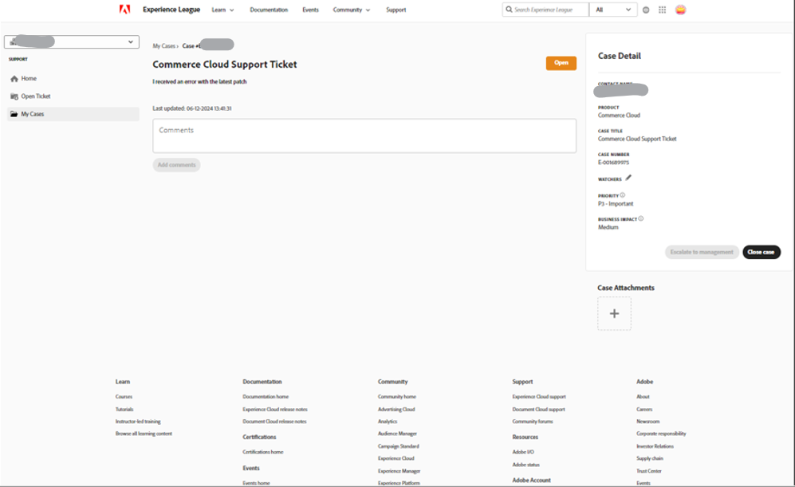

#### View your watched cases

You can view the cases you have been *added to as a watcher* by clicking **[!UICONTROL My organization's cases]** on the left-hand menu.

<!-- TODO: Add image here -->

#### Search for cases

To find cases, type your search query in the *[!UICONTROL Search]* field and press *enter* on your keyboard.

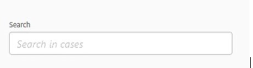

#### Escalate your cases

If you feel that a case requires further attention and our initial response time has passed, you may escalate the case. To do that,

1. Click on **[!UICONTROL Escalate to management]** at the bottom right of the *[!UICONTROL Case Detail]* panel on the right side of the screen.

    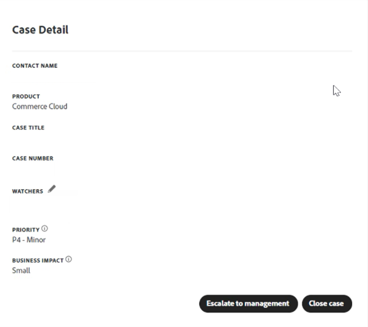

1. After clicking, a pop-up form will appear. Fill out the form and then click **[!UICONTROL Escalate]**.

    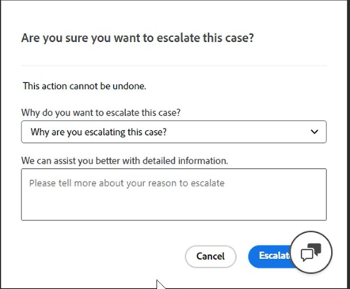

    *Reasons for escalation may include*: Agent Communication Skills, Agent Technical Knowledge, Awaiting Callback/Update, Change in Issue Urgency, Resolution did not meet expectations, or Time to Resolution.

#### Add a watcher on support cases

You can add watchers to support cases submitted by members of your organization. Watchers will receive email notifications when new cases are submitted or when existing cases are updated.

1. To add a watcher to an existing case, open the case and click on the pencil icon next to "watchers" in the Case Details panel on the right side of the screen.

    

1. After clicking on the pencil, you can add or remove watchers from the list.

    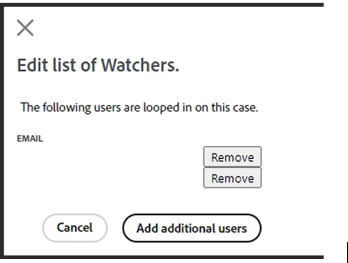

### Comments in your case {#comments-in-your-case}

Comments in your case contain all comments written by you or the Adobe Commerce support team. Comments are displayed from latest (on top) to earliest (bottom).
To add a comment, follow these steps:

1. Scroll to the bottom of your ticket.
1. Write your comment in the **[!UICONTROL Comments]** field and click **[!UICONTROL Add comments]**.

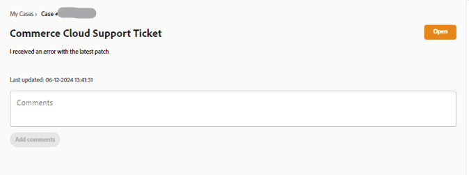

### Close your case {#close-case}

To close your case, click **[!UICONTROL Close case]** at the bottom right of the *[!UICONTROL Case Detail]* panel.

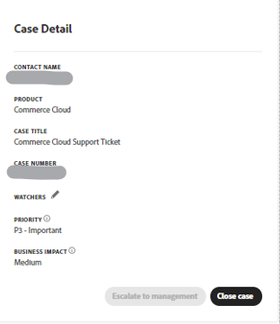

### Reopen your case {#reopen-case}

To reopen your case, reply to the email from our Support System related to that case and request the agent to reopen it. If you do this within 14 days of the case being closed, the agent can reopen the case for you. However, if it's after 14 days, the agent will have to create a new case.

### Submit ticket using Cloud Console {#cloud-console}

To submit a new support ticket using the Cloud Console, follow these steps:

1. Log in to the [Cloud Console](https://console.adobecommerce.com).
1. Select **[!UICONTROL Support]** in the user menu.
1. The **[!UICONTROL My Tickets]** page loads.
1. Click **[!UICONTROL Submit a ticket]** in the upper-right corner.
1. Fill in the fields.
1. Click **Submit**.
1. Click **[!UICONTROL Submit]**.

### Adobe Commerce P1 hotline {#P1-hotline}

The [Adobe Commerce P1 hotline](https://experienceleague.adobe.com/docs/commerce-knowledge-base/kb/how-to/adobe-commerce-p1-notification-hotline.html) article provides the P1 hotline numbers for Adobe Commerce when seeking help during a P1 incident and explains what information to provide.

### Adobe Commerce Shared Responsibility Operational Model {#shared-responsibility-operational-model}

See the article on [Adobe Commerce Shared Responsibility Operational Model](https://experienceleague.adobe.com/en/docs/commerce-operations/security-and-compliance/shared-responsibility#operational-responsibilities-summary), 
which aims to clarify operational responsibilities for our Pro infrastructure offering only.

### Open a follow-up ticket {#follow-up}

Opening a follow-up ticket will ensure that the original issue is linked to the follow-up ticket for continuity.

To open a follow-up ticket, click the "*create a follow-up*" link at the bottom of the ticket you wish to create a follow up to.

## SHARED ACCESS: GRANT PRIVILEGES FOR OTHER USERS TO ACCESS YOUR ACCOUNT {#shared-access}

You may grant limited access to your account for other Adobe Commerce account holders. In particular, using the **shared access** functionality, you may provide privileges for trusted employees and service providers to use your Help Center account so that they could work with your support tickets.

You can provide and manage shared access using your Adobe Commerce account page at [https://account.magento.com](https://account.magento.com/).

### Who can provide shared access {#who-can-provide-shared-access}

Only the account owner (primary account holder) with the according privileges can provide shared access for other users.

Managing users and their access is the customer's responsibility, especially in the shared access perspective. Thus, the Adobe Commerce support team cannot provide shared access to an Adobe Commerce account on behalf of a Customer. Customers are encouraged to add users with shared access themselves, using the [Adobe Commerce account page](https://account.magento.com/).

Users who have been provided with shared access cannot transfer or grant such access to other users.

### Provide shared access {#provide-shared-access}

See the [Share a Commerce account](https://experienceleague.adobe.com/en/docs/commerce-admin/start/commerce-account/commerce-account-share) section of Adobe Commerce Getting Started Guide for detailed steps on setting up a shared account.

After providing shared access for a new user, the related information is available in **Shared Access** > **Manage Permissions** of your Adobe Commerce account page.

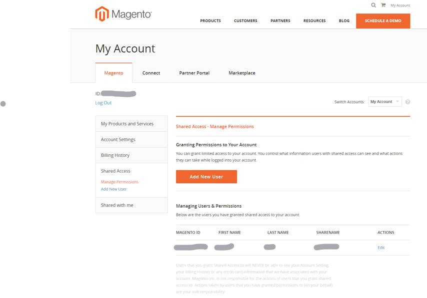

### Revoke (delete) shared access {#revoke-shared-access}

1. Log in to your Adobe Commerce account at [https://account.magento.com](https://account.magento.com/).
1. In the panel on the left, under Shared Access, choose **Manage Permissions.**
1. Find the user to revoke shared access from and click {width="25"} in the user's row (**Actions** column).
1. Click **Delete User** to revoke access or X in the top corner to cancel revoking.

   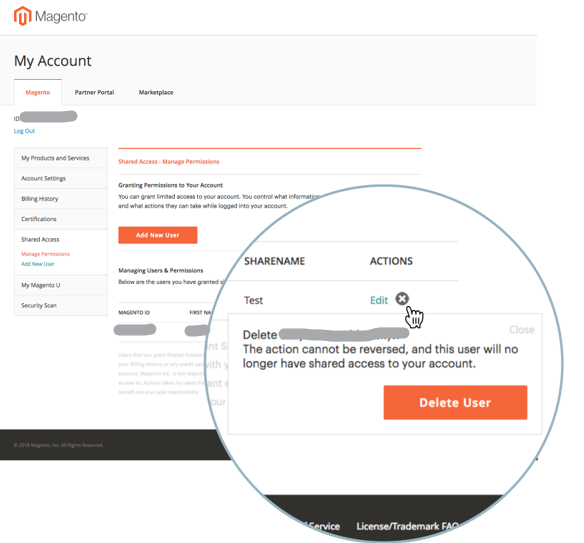{width="800"}

   You may also revoke shared access using the **Edit** menu:

1. Log in to your Adobe Commerce account at [https://account.magento.com](https://account.magento.com/).
1. In the panel on the left, under Shared Access, choose **Manage Permissions.**
1. Find the user to revoke shared access from and click **Edit** in the user's row (**Actions** column).
1. Click **Delete This User** at the bottom of the page.
1. In the confirmation popup, click **Delete User** to revoke access or X in the top corner to cancel revoking.

### How to delete users who were granted shared access via a Cloud project? {#remove-cloud-shared-access-users}

<u>Affected products and versions</u>

* Adobe Commerce Cloud (all versions)

<u>Cause</u>

If you have/had an Adobe Commerce Cloud project and had added a user to the project, they would have been automatically granted Shared Access on the Project Owner's MAGE ID. This would normally be indicated in the **[!UICONTROL Share Name]** column, showing *Cloud Shared Access from MAG[XYZ]*.

If the DELETE link is missing, that means that Shared Access was automatically granted through Commerce Cloud.

<u>Solution</u>

It's not possible to delete the list of Shared Access users with the Share Name of *Cloud Shared Access from MAG[XYZ]* if the Shared Access wasn't added/given on this page. These are retained for informational/audit purposes.

However, once you have revoked the permissions on those Shared Access users, they will no longer have that access.

1. Log in to your Adobe Commerce account at [https://account.magento.com](https://account.magento.com/).
1. In the panel on the left, under *[!UICONTROL Shared Access]*, choose **[!UICONTROL Manage Permissions]**.
1. Find the user to revoke shared access from and click **[!UICONTROL Edit]** in the user's row (*[!UICONTROL Actions]* column).
1. Uncheck all resources under *[!UICONTROL Grant Account Permissions]*.

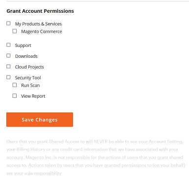{width="800"}

For more information, please refer to the [Manage User Access](https://experienceleague.adobe.com/docs/commerce-cloud-service/user-guide/project/user-access.html#manage-users-from-the-project-web-interface) documentation on our Commerce on Cloud Infrastructure Guide.

### Access shared account (switch accounts) {#switch-accounts}

To use the shared access provided for you, follow these steps:

1. Log in to your Adobe Commerce account at [https://account.magento.com](https://account.magento.com/).
1. Click the **Switch Accounts** menu and select an account.

   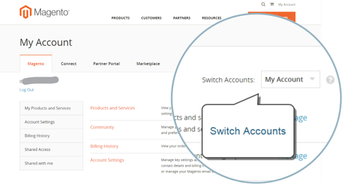{width="800"}

To know which account you are currently using (your own native account or shared access), see the **Switch Accounts** menu: it displays the active account.

### Shared access troubleshooting {#troubleshooting-shared-access}

Please refer to the [Shared access troubleshooting article](/help/troubleshooting/miscellaneous/shared-access-troubleshooting.md) in our support knowledge base.

## BILLING FAQ FOR ADOBE COMMERCE {#billing-faq}

Merchants typically pay for our services by a credit card (CC) transaction, and this [Billing FAQ for Adobe Commerce](/help/faq/general/billing-faq-for-adobe-commerce.md) is a resource to assist you when you pay your bill.

