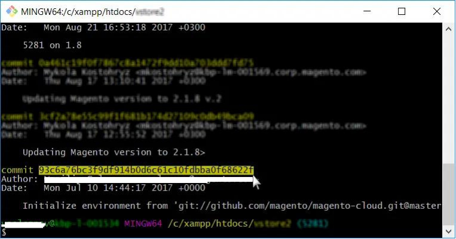

# Reset environment on Adobe Commerce on cloud infrastructure

This article shows different scenarios of rolling back an environment on Adobe Commerce on cloud infrastructure.
>[!NOTE]
>
>This guide applies to all Cloud Starter environments and only Integration environments on Cloud Pro.

Choose the most appropriate for your case:

* If you have planned activity (planned deployment or upgrade) - [Scenario 1: Planned activity)](#scen1).
* If you have a valid snapshot - [Scenario 2: Restore a snapshot](#scen2).
* If you have a stable build, but no valid snapshot - [Scenario 3: No snapshot, build stable (SSH connection available)](#scen3).
* If the build is broken and you have no valid snapshot - [Scenario 4: No snapshot; build broken (no SSH connection)](#scen4).

## Scenario 1: Planned activity

With a planned deployment or upgrade, the easiest and recommended [!UICONTROL Rollback] would be for the merchant, as part of your preparations, to do the following:

>[!NOTE]
>
>Always test these steps in your lower environment first!

<u>Five days prior to the upgrade/deployment activities</u>:

1. Check the size of the current Database.
1. Check that you have enough disk space on `/data/exports` to hold a [!UICONTROL Database Dump]. If you do not have enough disk space, then either remove unwanted data, or create a support case and request for the disk to be expanded.

<u>On the day of the changes</u>:

1. Place the website into [!UICONTROL Maintenance Mode].
Read more about [Enable or disable [!UICONTROL Maintenance Mode]](https://experienceleague.adobe.com/docs/commerce-operations/installation-guide/tutorials/maintenance-mode.html) in our user guide, and [[!UICONTROL Maintenance Mode] options for upgrade](https://experienceleague.adobe.com/docs/commerce-operations/upgrade-guide/troubleshooting/maintenance-mode-options.html) in our upgrade guide.
1. Disable cron jobs. Read more about disabling cron jobs in our [crons properties guide](<https://experienceleague.adobe.com/en/docs/commerce-cloud-service/user-guide/configure/app/properties/crons-property#disable-cron-jobs>).
1. Take a local [[!UICONTROL Database Dump]](https://experienceleague.adobe.com/docs/commerce-knowledge-base/kb/how-to/create-database-dump-on-cloud.html).

<u>If a [!UICONTROL Rollback] is required</u>:

1. If Applications such as [!DNL MariaDB] was upgraded as part of this planned activity, have that application reinstalled to a previous version first.
1. [!UICONTROL Rollback] the Database using the local [!UICONTROL Database Dump], and import this back into [!DNL MariaDB].
1. [!UICONTROL Rollback] the code via [!DNL Git] to a previous working version.

Using [!UICONTROL Snapshots] is not the recommended way for upgrade/planned activity [!UICONTROL rollbacks/restores], as it takes much longer to retrieve the data compared to a local [!UICONTROL Database Dump], as taken above in Step 2 of the **If a [!UICONTROL Rollback] is required** section.

[!UICONTROL Snapshots] are not held on the node/server, they are held on a separate storage block, and since that data has to be transmitted from the block storage over the network to a new disk, it takes time in the process. That new disk is then mounted onto the node ready for retrieval/import onto the original disk connected to the node/server.

When you compare this to importing a local [!UICONTROL Database Dump], the data is already retrievable on the node/server, so a lot of time is saved as only a [!UICONTROL Database Import] is required.

## Scenario 2: Restore a snapshot

Read: [Restore a snapshot on Adobe Commerce on cloud infrastructure](https://experienceleague.adobe.com/en/docs/commerce-cloud-service/user-guide/develop/storage/snapshots#restore-snapshot) in our developer documentation.

>[!NOTE]
>
>Creating a snapshot must be our very first step after accessing the Adobe Commerce on cloud infrastructure account and before applying major changes. It is a best practice and highly recommended.

Read: [Create a snapshot](https://experienceleague.adobe.com/en/docs/commerce-cloud-service/user-guide/develop/storage/snapshots#create-snapshot) in our developer documentation.

## Scenario 3: No snapshot, build stable (SSH connection available)

This section shows how to reset an environment when you have not created a snapshot but can access the environment via SSH.

The steps are:

1. Disable Configuration Management.
1. Uninstall the Adobe Commerce software.
1. Reset the [!DNL git] branch.

After performing these steps:

* Your Adobe Commerce installation returns to its Vanilla state (database restored; deployment configuration removed; directories under `var` cleared).
* Your [!DNL git] branch is reset to the desired state in the past.

Read the detailed steps below.

### Step 0 (Prerequisite): Remove config.php to disable Configuration Management

We need to disable Configuration Management so that it does not automatically apply the previous configuration settings during deployment.

To disable Configuration Management, make sure that your `/app/etc/` directory does not contain the `config.php` file.

To remove the configuration file, follow these steps:

1. [SSH to your environment](https://experienceleague.adobe.com/docs/commerce-cloud-service/user-guide/develop/secure-connections.html).
1. Remove the configuration file: `rm app/etc/config.php`

Read more about  [Configuration management for store settings](https://experienceleague.adobe.com/docs/commerce-cloud-service/user-guide/configure-store/store-settings.html) in our developer documentation.

### Step 1: Uninstall the Adobe Commerce software with setup:uninstall command


Uninstalling the Adobe Commerce software drops and restores the database, removes the deployment configuration, and clears directories under `var`.

Read: [Uninstall the Adobe Commerce software](https://experienceleague.adobe.com/docs/commerce-operations/installation-guide/tutorials/uninstall.html) in our developer documentation.

To uninstall the Adobe Commerce software, follow these steps:

1. [SSH to your environment](https://experienceleague.adobe.com/docs/commerce-cloud-service/user-guide/develop/secure-connections.html).
1. Execute `setup:uninstall` : `bin/magento setup:uninstall`
1. Confirm uninstall.

The following message displays to confirm a successful uninstallation:

```php
[SUCCESS]: Magento uninstallation complete.
```

This means we have reverted our Adobe Commerce installation (including DB) to its authentic (Vanilla) state.

### Step 2: Reset the [!DNL git] branch

With [!DNL git] reset, we revert the code to the desired state in the past.

1. Clone the environment to your local development environment. You may copy the command in the Cloud Console:    
1. Access the commits history. Use `--reverse` to display history in reverse order for more convenience: `git log --reverse`
1. Select the commit hash on which you've been good. To reset code to its authentic state (Vanilla), find the very first commit that created your branch (environment).

1. Apply hard [!DNL git] reset: `git reset --h <commit_hash>`
1. Push changes to server: `git push --force <origin> <branch>`

After performing these steps, our [!DNL git] branch gets reset and the entire [!DNL git] changelog is clear. The last [!DNL git] push triggers the redeploy to apply all changes and re-install Adobe Commerce.

## Scenario 4: No snapshot; build broken (no [!DNL SSH] connection)

This section shows how to reset an environment when it is in a critical state: the deployment procedure cannot succeed in building a working application, thus making the [!DNL SSH] connection unavailable.

In this scenario, you must first restore the working state of your Adobe Commerce application using [!DNL git] reset, then uninstall the Adobe Commerce software (to drop and restore the database, remove the deployment configuration, etc.). The scenario involves the same steps as in Scenario 3, but the order of steps is different and there is an additional step &ndash; force redeploy. The steps are:

1. [Reset the [!DNL git] branch.](/help/how-to/general/reset-environment-on-cloud.md#reset-git-branch)
1. [Disable Configuration Management.](/help/how-to/general/reset-environment-on-cloud.md#disable_config_management)
1. [Uninstall the Adobe Commerce software.](/help/how-to/general/reset-environment-on-cloud.md#setup-uninstall)
1. Force redeploy.

After performing these steps, you will have the same results as in Scenario 3.

### Step 4: Force redeploy

Make a commit (this might be an empty commit, although we do not recommend it) and push it to the server to trigger redeploy:

```git
git commit --allow-empty -m "<message>" && git push <origin> <branch>
```

## If setup:uninstall fails, reset database manually

If executing the `setup:uninstall` command fails with an error and cannot be completed, we may clear the DB manually with these steps:

1. [SSH to your environment](https://experienceleague.adobe.com/docs/commerce-cloud-service/user-guide/develop/secure-connections.html).
1. Connect to the MySQL DB: `mysql -h database.internal` (For Pro environments see: [Set up MySQL service](https://experienceleague.adobe.com/docs/commerce-cloud-service/user-guide/configure/service/mysql.html)).
1. Drop the `main` DB : `drop database main;`
1. Create an empty `main` DB: `create database main;`
1. Delete the following configuration files: `config.php`, `config.php.bak`, `env.php`, `env.php.bak`

After resetting the DB, [make a [!DNL git] push to the environment to trigger redeploy](https://experienceleague.adobe.com/docs/commerce-operations/configuration-guide/deployment/examples/example-using-cli.html) and install Adobe Commerce to a newly created DB. Or [run the redeploy command](https://experienceleague.adobe.com/docs/commerce-cloud-service/user-guide/dev-tools/cloud-cli.html#environment-commands).
