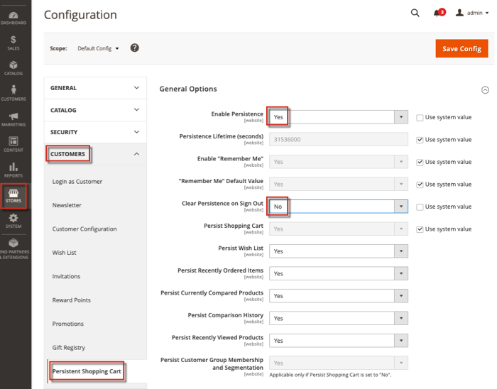

# MDVA-34023 patch: "No such entity with addressId" error

The MDVA-34023 patch solves the issue where `No such entity with addressId` errors occur randomly on a customer's web browser.

This patch is available when the [Quality Patches Tool (QPT)](/help/announcements/adobe-commerce-announcements/magento-quality-patches-released-new-tool-to-self-serve-quality-patches.md) 1.0.15 is installed. Please note that the issue is scheduled to be fixed in Adobe Commerce version 2.4.3.

## Affected products and versions

 **The patch is created for Adobe Commerce version:** Adobe Commerce on cloud infrastructure 2.3.1

 **Compatible with Adobe Commerce versions:** Adobe Commerce on cloud infrastructure and Adobe Commerce on-premises 2.3.0 - 2.4.2

>[!NOTE]
>
>The patch might become applicable to other versions with new Quality Patches Tool releases. To check if the patch is compatible with your Adobe Commerce version, update the `magento/quality-patches` package to the latest version and check the compatibility on the [QPT landing page](https://devdocs.magento.com/quality-patches/tool.html#patch-grid). Use the patch ID as a search keyword to locate the patch.

## Issue

<u>Steps to reproduce</u>:

1. Go to **Stores** > **Settings** > **Configuration** > **Customers tab** > **Persistent shopping cart**.
1. Set **Enable Persistence** = *Yes*, set **Clear Persistence on Sign Out** = *No*.    
1. Create a new customer, and define the default shipping and billing addresses.
1. Log out.
1. Log in with the **Remember me** checkbox selected.
1. Go to the `customer_entity` DB table and change the `default_billing` and `default_shipping` IDs to non-existing ones.
1. Log out.

<u>Expected results</u>:

No errors appear, as expected.

<u>Actual results</u>:

The exception log is generated:

```php
Exception.log:
{"0":"No such entity with addressId = XXXXX","1":"#0 /vendor\/magento\/module-customer\/Model\/AddressRegistry.php(49): Magento\\Framework
Exception
NoSuchEntityException::singleField('addressId', 'XXXXX')
```

## Apply the patch

To apply individual patches, use the following links depending on your deployment method:

* Adobe Commerce or Magento Open Source on-premises: [Software Update Guide > Apply Patches](https://devdocs.magento.com/guides/v2.4/comp-mgr/patching/mqp.html) in our developer documentation.
* Adobe Commerce on cloud infrastructure: [Upgrades and Patches > Apply Patches](https://devdocs.magento.com/cloud/project/project-patch.html) in our developer documentation.

## Related reading

To learn more about Quality Patches Tool, refer to:

* [Quality Patches Tool released: a new tool to self-serve quality patches](/help/announcements/adobe-commerce-announcements/magento-quality-patches-released-new-tool-to-self-serve-quality-patches.md) in our support knowledge base.
* [Check if patch is available for your Adobe Commerce issue using Quality Patches Tool](/help/support-tools/patches-available-in-qpt-tool/check-patch-for-magento-issue-with-magento-quality-patches.md) in our support knowledge base.

For info about other patches available in QPT tool, refer to the [Patches available in QPT](https://support.magento.com/hc/en-us/sections/360010506631-Patches-available-in-QPT-tool-) section.
