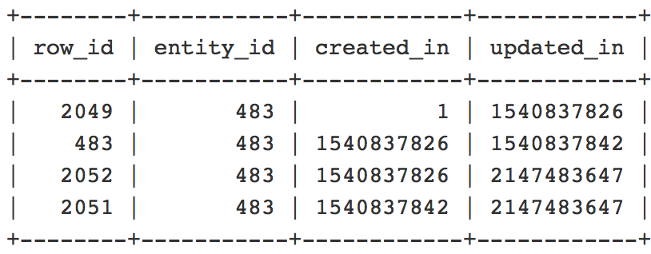

# Multiple rows in the database for the same entity

This article provides a solution to the issue where there are multiple rows for the same entity ID in the database.

## Affected products and versions:

* Adobe Commerce (All versions)

## Issue

There are multiple rows for the same entity ID in the database.

For example, after receiving a list of records with duplicate entity IDs when you run this query:

```
SELECT * FROM $entityTable WHERE $column = <$entityID> ORDER BY created_in;
```

Where `$entityID = ID` of category/product/cart price rule/catalog price rule/CMS page.

|     Entity       |      $entityTable                 |      $column     |
|------------------|-----------------------------------|------------------|
| Category/Product | catalog_category_entity/catalog_product_entity | entity_id |
| Cart Price Rule/Catalog Price Rule | salesrule/catalogrule | rule_id  |
| CMS Page   | cms_page   | page_id  |

## Cause

This is the expected behavior. The multiple rows are created by the Content Staging functionality:

* If you specify a start date without an end date, there will be at least two rows with the same entity/rule/page ID. One row will indicate the original state of the entity (the row in which `created_in=1`), and one row will indicate the *End of the Scheduled Update*.

* If you specify a start date with an end date, there will be at least three rows with the same entity/rule/page ID. One row will indicate the original state of the entity (the row in which `created_in=1`), one row will be for the *Start of the Scheduled Update*, and one row will be for the *End of the Scheduled Update*.

For example, in this query:

```
SELECT row_id, entity_id, created_in, updated_in FROM catalog_product_entity WHERE entity_id = 483 ORDER BY created_in;
```



* The `created_in` and `updated_in` values should follow this pattern: The `created_in` value of the current row is equal to the `updated_in` value in the previous row. Also, the first row should contain `created_in = 1` and the last row should contain `updated_in = 2147483647`. (If there's only one row, you must see `created_in=1` and `updated_in=2147483647`).

### Why does the second DB entry (and all the next ones) appear in DB for the same entity?

* The second DB record (and, possibly, the next ones) for the affected entity means there have been Content Staging updates scheduled using the `Magento_Staging` module, which makes an additional record for an entity in the respective tables.

A problem would only occur if the records have the same values for the `created_in` or `updated_in` columns.

## Solution 

This is the expected behavior and will only lead to issues if there are discrepancies between the rows.

## Related reading

* [Changes to categories are not being saved](https://experienceleague.adobe.com/docs/commerce-knowledge-base/kb/troubleshooting/miscellaneous/changes-to-categories-are-not-being-saved.html) in our support knowledge base
* [Best practices for modifying database tables](https://experienceleague.adobe.com/en/docs/commerce-operations/implementation-playbook/best-practices/development/modifying-core-and-third-party-tables#why-adobe-recommends-avoiding-modifications) in the Commerce Implementation Playbook
