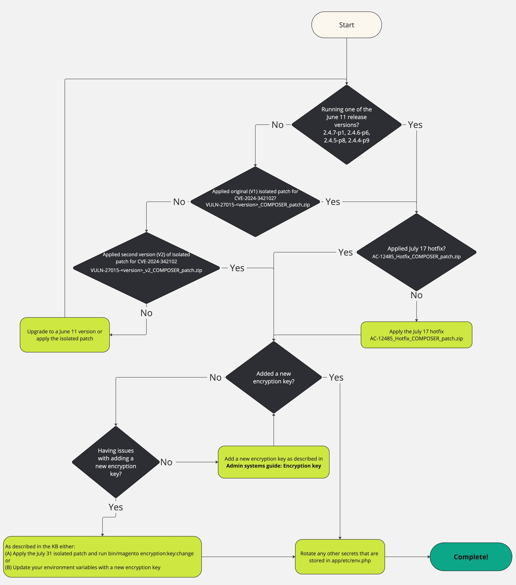

# Troubleshooting Encryption Key Rotation: [!DNL CVE-2024-34102]

This article is intended to help merchants troubleshoot encryption key rotation after they have already followed the steps outlined in this [article](https://experienceleague.adobe.com/en/docs/commerce-knowledge-base/kb/troubleshooting/known-issues-patches-attached/security-update-available-for-adobe-commerce-apsb24-40-revised-to-include-isolated-patch-for-cve-2024-34102) on [!DNL CVE-2024-34102]. 

If you have already followed the steps in the article above and have issues rotating your encryption keys, we have an isolated patch to help resolve potential issues. 

To help illustrate the steps that have been previously communicated and summarized above, to protect against [!DNL CVE-2024-34102], as well as the additional troubleshooting found below, you can also utilize this flow chart:


 {zoomable="yes"}


## How to apply the isolated patch to run the new command

Unzip the file and see [How to apply a composer patch provided by Adobe](https://experienceleague.adobe.com/docs/commerce-knowledge-base/kb/how-to/how-to-apply-a-composer-patch-provided-by-magento.html) in our support knowledge base for instructions.

## Adding a new encryption key without using environment variables

The default application behavior is to store the encryption key in the `app/etc/env.php` file.

The [steps outlined in the documentation](https://experienceleague.adobe.com/en/docs/commerce-admin/systems/security/encryption-key) describe how to change this key within that file using the [!UICONTROL Admin] interface.

The steps and isolated patch provided in this section allow you to easily change the value in that file and will allow you to work around the issues you may be experiencing through the [!UICONTROL Admin] interface.

However, the easiest and more secure way to manage the encryption key is to use environment variables. If you are already using environment variables, or are interested in using them to manage this key instead, there is a separate section which describes those steps.

## Affected products and versions

Adobe Commerce on Cloud, Adobe Commerce on-premises, and Magento Open Source:

* 2.4.7-p1 and earlier
* 2.4.6-p6 and earlier
* 2.4.5-p8 and earlier
* 2.4.4-p9 and earlier

## Isolated Patch for Troubleshooting Encryption key rotation details

Use the following attached patches, depending on your Adobe Commerce/Magento Open Source version:

### For version 2.4.7, 2.4.7-p1:

* [ac-12589-2-4-7x-composer-patch.zip](assets/ac-12589-2-4-7x-composer-patch.zip)

### For versions 2.4.6, 2.4.6-p1, 2.4.6-p2, 2.4.6-p3, 2.4.6-p4, 2.4.6-p5, 2.4.6-p6:

* [ac-12589-2-4-6x-composer-patch.zip](assets/ac-12589-2-4-6x-composer-patch.zip)

### For versions 2.4.5, 2.4.5-p1, 2.4.5-p2, 2.4.5-p3, 2.4.5-p4, 2.4.5-p5, 2.4.5-p6, 2.4.5-p7, 2.4.5-p8:

* [ac-12589-2.4.5x_COMPOSER_patch.zip](assets/ac-12589-2-4-5x-composer-patch.zip)

### For versions 2.4.4, 2.4.4-p1, 2.4.4-p2, 2.4.4-p3, 2.4.4-p4, 2.4.4-p5, 2.4.4-p6, 2.4.4-p7, 2.4.4-p8, 2.4.4-p9:

* [ac-12589-2-4-4x-composer-patch.zip](assets/ac-12589-2-4-4x-composer-patch.zip)


After you install the isolated patch, change the active encryption key with the new [!DNL CLI] command.

>[!NOTE]
>
>**This new [!DNL CLI] command will trigger a cache clean upon execution.**

1. This new command should be executed on the environment that contains your `app/etc/env.php` file for the key that you want to update.
1. Confirm that the new command exists:

    ```
    bin/magento list | grep encryption:key:change
    ```

    You should see the following output:

    ```
    encryption:key:change Change the encryption key inside the env.php file.
    ```

1. Change the encryption key:

    ```
    bin/magento encryption:key:change
    ```

1. If you have executed this command on your production system, no further action should be required.
If you have run this on a development system, you **must** get this change into your production system as you would normally deploy sensitive configuration settings.

## Update the encryption key using environmental variables instead of using the isolated patch

As an alternative to the section above, these steps will allow you to add a new encryption key while preserving your existing encrypted data, even if you are currently using the default `app/etc/env.php`.
**This section applies to Adobe Commerce on Cloud and Cloud Starter, but also applies to Adobe Commerce on-premises**, although the exact steps and locations of the variables will be dependent on your infrastructure. 

### Collect your current value

* If you are already managing your keys with environment variables, it may be in [several possible locations](https://experienceleague.adobe.com/en/docs/commerce-cloud-service/user-guide/configure/env/stage/variables-intro), but most likely it will be in the [`CRYPT_KEY`](https://experienceleague.adobe.com/en/docs/commerce-cloud-service/user-guide/configure/env/stage/variables-deploy#crypt_key) variable as described in the documentation.
* If you are not using variables, the encryption key will be in `app/etc/env.php` within the `crypt/key` data key.  

In either case, it may be a multiline value and contain multiple items prefixed with `base64`. 

### Generate a new key 

Encryption keys are 32 bytes of random data which are encoded with [!DNL base64] and prefixed with `base64`.
To generate a new key:

1. Using the tool of your choice, generate 32 random bytes of data encoded with [!DNL base64]. For example, using the [!DNL OpenSSL CLI], you can run `openssl rand -base64 32`, but any trustworthy cryptographically random generation tool may be used.  
1. Prefix that value with `base64`. For example, if the `openssl` command output *ABC123*, the value would become: *base64ABC123*

### Craft the new value

Append the generated value to your existing value that you collected above. For example, if your existing value is *base64HelloWorld*, your new value would become:<br>

```
base64HelloWorld
base64ABC123
```

### Add a new environment variable

Use the [[!UICONTROL Cloud Console] or [!DNL magento-cloud CLI]](https://experienceleague.adobe.com/en/docs/commerce-cloud-service/user-guide/configure/env/variable-levels) to set the `env:MAGENTO_DC_CRYPT__KEY` [environment variable](https://experienceleague.adobe.com/en/docs/commerce-cloud-service/user-guide/configure/env/stage/variables-cloud) to this new value.

>[!NOTE]
>
>Be advised that if you choose to mark the variable as *sensitive*, you may want to save an external backup of this value, since it will be hidden from all interfaces and only visible to the application.

Upon saving the variable, a redeployment will be triggered automatically which will cause the value to be applied.

## Security updates

Related security updates available for Adobe Commerce:

* [Security update available for Adobe Commerce - APSB24-40](https://experienceleague.adobe.com/en/docs/commerce-knowledge-base/kb/troubleshooting/known-issues-patches-attached/security-update-available-for-adobe-commerce-apsb24-40-revised-to-include-isolated-patch-for-cve-2024-34102)
* [Adobe Security Bulletin ([!DNL APSB24-40])](https://helpx.adobe.com/security/products/magento/apsb24-40.html)
