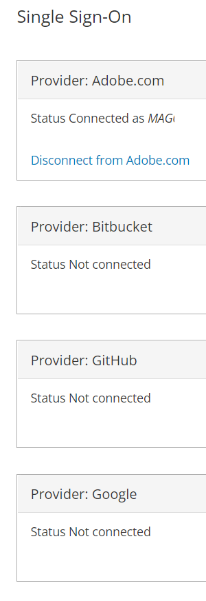
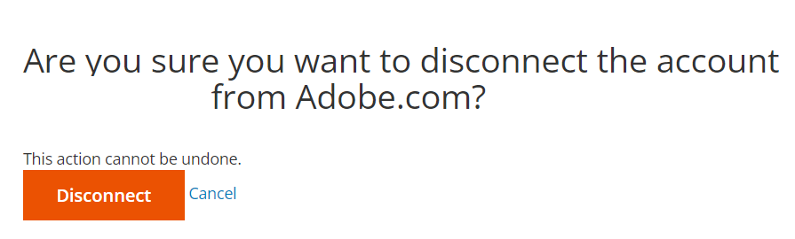
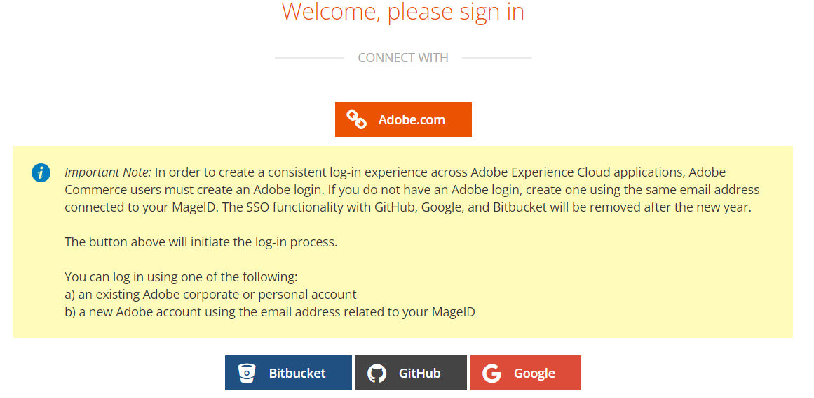

# Cannot access the correct cloud project

This article provides a fix for the following issues after a change has been made to the account ownership or the associated email addresses:

1. You are unable to access the correct cloud Adobe Commerce project(s).
1. No cloud Adobe Commerce projects are shown under your account at [accounts.magento.cloud/user](https://accounts.magento.cloud/user).
1. You are seeing the details of another account (i.e., the previous account owner) at [accounts.magento.cloud/user](https://accounts.magento.cloud/user).

## Issue

You are unable to access the correct cloud Adobe Commerce project when there are changes in ownerships or changes in email addresses.

## Affected products and versions

* Adobe Commerce on cloud infrastructure, [all supported versions](https://www.adobe.com/content/dam/cc/en/legal/terms/enterprise/pdfs/Adobe-Commerce-Software-Lifecycle-Policy.pdf)

## Cause

This issue typically happens when previous project owner's single sign-on (SSO) is still integrated with Adobe.com after:

1. The cloud project ownership had been transferred to you (the user) and you see the original project owner's account. Click here for the [solution](#solution-for-cause-one-and-two).

    OR

1. You (the user) have moved to a different company, accompanied by a change in the email address and the projects you have access to. You see the projects that you had been granted access to in your previous role/company. Click here for the [solution](#solution-for-cause-one-and-two).

    OR

1. You have changed your email address at https://account.adobe.com to another email address that is not currently associated with a cloud project. Click here for the [solution](#solution-for-cause-three).

## Solution for cause one and two {#solution-for-cause-one-and-two}

The solution for when the issue is caused by one and two is disconnecting the single sign-on integration with Adobe.com. Follow the steps below to disconnect:

1. From https://accounts.magento.cloud/user, expand the **[!UICONTROL Single Sign-On]** section. Click **[!UICONTROL Disconnect from Adobe.com]**, to disconnect.

    

1. Click **[!UICONTROL Disconnect]**.

    

1. Log out.
1. Click on the **[!UICONTROL Adobe.com]** button.

    

1. You should now be able to see the correct account and access the correct cloud project.

## Solution for cause three {#solution-for-cause-three}

If the issue has been caused by cause three, ask an existing super user on the project to add your new email address to the project. For more information, refer to [Manage user access](https://experienceleague.adobe.com/docs/commerce-cloud-service/user-guide/project/user-access.html).
