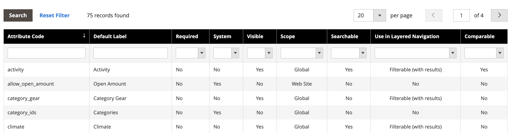

# [!DNL Live Search] facets are not alphabetically sorted

## Affected products and versions

Adobe Commerce versions 2.4.x and newer

## Issue

All Adobe Commerce storefront facets are sorted alphabetically with single-select options, regardless of the input type that is assigned to the corresponding attribute.

## Workaround

However, in certain edge cases, facets might not sort alphabetically as set up in the [[!DNL Live Search] Faceting workspace](https://experienceleague.adobe.com/en/docs/commerce-merchant-services/live-search/live-search-admin/facets/faceting-workspace).

As a workaround, you can sort product attributes in the [!UICONTROL Admin] attributes section.

1. On the **[!UICONTROL Admin]** sidebar, go to **Stores** > *Attributes* > **Product**.
1. Select an attribute from the table.

   

1. Open the attribute that has the values you want to sort and select **Attribute Information** > **Properties**. 
1. Under **Manage Options**, you can sort the attribute values.

    
