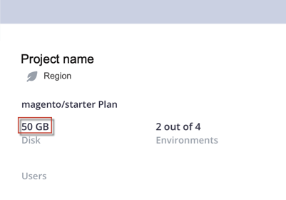

# Low disk space

This article suggests solutions for the situation when you run out of space on a certain environment of Adobe Commerce on cloud infrastructure.

## Affected products and versions

* Adobe Commerce on cloud infrastructure, all [supported versions](https://magento.com/sites/default/files/magento-software-lifecycle-policy.pdf)

## Issue

You are running out of disk space on the disk with writable directories. One symptom can be [stuck deployment](/help/troubleshooting/deployment/deployment-stuck-with-unable-to-upload-the-application-to-the-remote-cluster-error.md).

To check the disk usage, run the following command:

```bash
df -h var/
```

## Cause

The `var` directory is usually the one that could take a lot of space and can be cleaned easily.

Adobe Commerce stores all log files in the `var` directory. New log files are created and old ones are archived daily. But if the number of generated errors keeps growing, log files take more and more space.

Custom import/export files are also stored in the `var` directory, and take space if their numbers increase.

## Solution

Solution options:

* Check if you have large log files and investigate why they are big, fix the issue generating a big amount of log output.
* Clean the `var` directory.
* Set up a cron job to track the size of the `var` directory and clean it.
* Allocate more disk space, if you have some unused. (See the section below for information on how to check what is your space limit.)
    * For Starter plan, all environments, and Pro plan Integration environments, you can allocate the disk space if you have some unused, as described in [Manage disk space: Allocating disk space](https://devdocs.magento.com/guides/v2.3/cloud/project/manage-disk-space.html#application-disk-space).
    * For Pro plan Staging and Production environments, contact support to allocate more disk space if you have some unused.
* If you have reached your space limit and still experience low space issues, consider buying more disk space, contact your Adobe Account Team for details.

### Check disk space limit

To check how much space you have for each Adobe Commerce on cloud infrastructure environment:

1. Log in to the [Cloud Console](https://console.adobecommerce.com).
1. On the **[!UICONTROL ALL projects]** dashboard, select the relevant project. In the left corner you see disk space availability.

    
