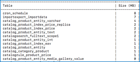

# Adobe Commerce 2.4.0 known issue - Export Tax Rates does not work

This article provides a solution for an Adobe Commerce 2.4.0 known issue where the **Export Tax Rates** button does not work.

## Affected products and versions

* Adobe Commerce on cloud infrastructure 2.4.0
* Adobe Commerce on-premises 2.4.0

## Issue

 <u>Steps to reproduce:</u>

1. Go to the Commerce Admin Panel > **Stores** > **Tax Rules**.
1. Click the **Add New Tax Rule** button.
1. Click on the text of the **Export Tax Rates** button.

    

 <u>Expected result</u>:

 A `tax_rates.csv` file downloads containing tax rates.

 <u>Actual result</u>:

 No .csv file is downloaded.

## Solution

Workaround:

Click on the bottom left edge of the **Export Tax Rates** button to export the `tax_rates.csv` file.

It is planned that the issue will be resolved in a 2.4.1 patch.

## Related reading

In our support knowledge base:

* [Adobe Commerce 2.4.0 known issue: Braintree payment methods do not show up in Multiple Addresses checkout](/help/troubleshooting/payments/magento-2.4.0-braintree-not-in-multiple-addresses-checkout.md).
* [Shipping labels creation known issue in Adobe Commerce 2.4.0](/help/troubleshooting/known-issues-patches-attached/shipping-labels-creation-known-issue-in-magento-2.4.0.md).
* [Adobe Commerce 2.4.0 known issue - refresh on Customer's Activities does not work](/help/troubleshooting/miscellaneous/magento-2.4.0-refresh-on-customer-activities-does-not-work.md).
* [Adobe Commerce 2.4.0 known issue: raw message data display on storefront](/help/troubleshooting/storefront/magento-2.4.0-issue-storefront-raw-message-data-display.md).
* [Adobe Commerce 2.4.0 known issue: “Add selections to my cart” button does not work](/help/troubleshooting/miscellaneous/magento-2.4.0-add-selections-to-my-cart-does-not-work.md).
